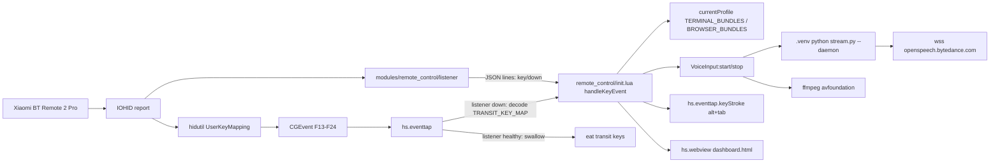
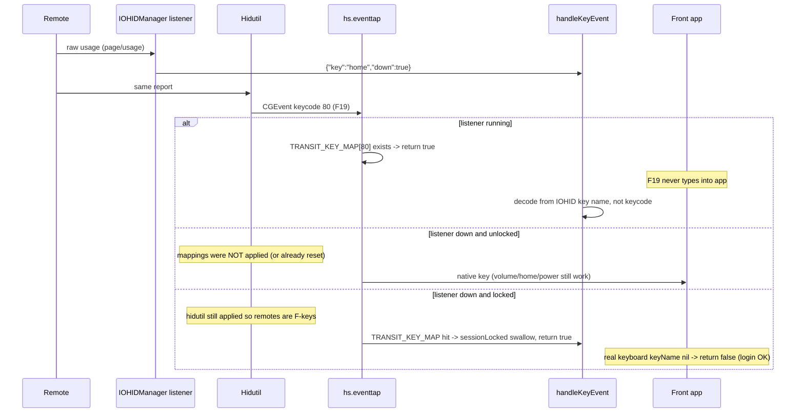
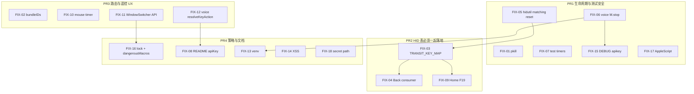

# Hammerspoon 配置修复规格（Fix-Target Specification）

| 字段 | 值 |
| :--- | :--- |
| **Title** | Hammerspoon 工作区完整修复规格 |
| **Author** | TBD |
| **Date** | 2026-09-20 |
| **Status** | Draft（rev 3：H 内联 teardown、attachLockWatcher、J0/J-final） |
| **Audience** | 无对话上下文的实现 Agent |
| **Workspace** | `/Users/banbxio/.hammerspoon` |
| **Branch** | `main`（实现前视为干净；HEAD == origin/main） |
| **Review source** | `/var/folders/bm/bnv2nh7j36q_h3yshkg4m9dm0000gn/T/grok-banbxio/grok-review-1a9fa845.md` |

本文档是**可执行合同**，不是讨论稿。实现 Agent 必须按 Work Item 逐条落地，不得重新裁决「问题是否存在」。若实现时发现行号漂移，以**函数名 / 标识符**为准，并在 PR 说明中标注新位置。

---

## Overview

这是一套已在使用的 Hammerspoon 个人配置，三个模块分别是：`modules/remote_control`（Swift `IOHIDManager` + `hidutil` + `hs.webview` 仪表盘）、`modules/voice_input`（豆包流式 ASR，Flash HTTP 兜底）、`modules/window_switcher`（基于 `hs.window.orderedWindows` 的垂直 Alt-Tab）。

全仓审查确认了 8 个 bug、9 个 suggestion、1 个 nit。本规格把它们映射为 **FIX-01 … FIX-18**，给出当前行为、根因、目标行为、实现步骤、测试与验收。核心修复集中在四条链：

1. **HID 隔离表必须自洽**：`applyHidutil()` 的 src/dst 与 `TRANSIT_KEY_MAP` 一一对应；Home 与 Volume Down 不得再共享 F23；listener 失败时不得留下死键；`resetHidutil()` 必须带 VID/PID。
2. **生命周期必须 reload-safe**：遥控器只杀本模块 `listener` PID；语音模块补 `M.stop()` + `hs.shutdownCallback`，避免 Python daemon / ffmpeg / `.apikey` 泄漏。
3. **遥控器语义必须与 README / config 一致**：`profiles.*.bundleIDs` 真正参与路由；语音键走 `resolveKeyAction`；菜单键调用 WindowSwitcher 显式 API 而非合成 Alt-Tab；鼠标模式用 `hs.timer` 平滑移动。
4. **安全默认值符合「个人主力机」决策**：危险宏默认仍开启，但锁屏/屏保必须丢弃全部遥控事件；去掉 `hs.allowAppleScript(true)`；仪表盘 XSS 用 `textContent`；密钥不得进日志。

---

## Background & Motivation

当前主路径（IOHID 监听、tap/hold/double-tap、终端/浏览器默认映射、窗口过滤测试）与 README 大体一致，`.gitignore` 也正确排除了 `secret.lua` / `config.json` / `listener` 二进制 / `*.log`。但下列事实会在日常 reload、listener 编译失败、跑测试、或锁屏时造成真实伤害：

- `pkill -f 'remote_hid_listener|modules/remote_control/listener'` 会误杀正在编辑 `listener.swift` 的编辑器。
- `resetHidutil()` 执行全局 `hidutil property --set '{"UserKeyMapping":[]}'`，会清掉用户其它键盘的映射。
- `TRANSIT_KEY_MAP` 只有 F13–F20，hidutil 却把 TV/音量/Home/Power 映到 F21–F24，且 Home 与 Volume Down 都进 F23。
- `voice_input` 的 `M.start()` 返回带会话级 `start`/`stop` 的 controller，但**没有模块级 teardown**；Hammerspoon reload 时 `hs.shutdownCallback` 不会停 Python daemon。
- `tests/remote_control_test.lua` Test 5e 在约 250ms 后会对真实桌面触发 `action:mission_control`。
- README 要求填写 `appId` / `accessToken` / `cluster`，运行时只认 `apiKey`。

本规格禁止推倒重写。所有改动必须是外科手术式 patch，并保持 `M.start()` / `M.stop()` 可重入。

---

## Goals & Non-Goals

### Goals

- 落地审查列出的全部 18 个问题（可合并实现，但不可丢 ID）。
- 修复后 README、`config.json.example`、`secret.lua.example`、仪表盘文案与运行时行为一致。
- 每个可在无硬件条件下单测的行为都有 `tests/*.lua` 覆盖。
- Hammerspoon Reload Config 后：无残留 `listener` / `stream.py --daemon` / ffmpeg；本设备 hidutil 先 reset 再 apply；其它键盘映射不被破坏。
- 锁屏或屏保期间丢弃全部遥控 HID 事件。

### Non-Goals

- 不重写三个模块，不换架构（listener 仍是主 HID 路径；hidutil+eventtap 只做隔离/降级）。
- 不把 dashboard 改成 HTTP server；JS bridge 保持 `file://` + `hs.webview.usercontent`。
- 不新增阻塞式确认手势（会破坏单手遥控）。
- 不把流式 ASR 改成唯一路径；Flash 仍是可见降级。
- 不修改 gitignore 的本地文件：`modules/**/secret.lua`、`modules/**/config.json`、`modules/**/hotwords.lua`、已编译 `listener`、`*.log`。
- 不把 `apiKey` 放到新的全局变量。
- 不为了「更安全」默认关闭 `macro:approve_agent`（个人主力机，保持现状，另提供 `dangerousMacros` 开关）。

---

## Implementer Contract

实现 Agent **必须**遵守：

1. **外科手术**：禁止按文件重写模块。每个 diff 应能对照某个 FIX-ID。
2. **范围冻结**：禁止实现本文未列出的功能、重构或依赖升级（`requirements.txt` 除外，且只加 `websockets`）。
3. **风格**：跟随现有 Lua / Swift / Python / HTML。注释只写非显而易见的 WHY，不叙述过程，不留 `TODO` 占位。
4. **密钥**：禁止 commit `secret.lua`、`config.json`、`listener` 二进制、`*.log`、`.apikey`。禁止把 API key、转写正文、`.apikey` 内容打印到 log / alert / commit。
5. **Reload-safe**：`M.start()` 第一件事调用 `M.stop()`（可重入 no-op）。`hs.shutdownCallback` **只**调用 `M.stop()` 再 `prevShutdown()`，禁止在 callback 里复制一份残缺清理。`M.stop()` 是 listener / eventtap / hotkey / dashboard / 全部 timer（含 `mouseTimer`）/ lockWatcher / matching-reset 的唯一所有者。
6. **测试**：凡无硬件可测的行为，更新 `tests/*.lua`。teardown 不得触发 Mission Control、显示器休眠、切窗口、移动指针、滚轮。`testFireTimer` / `testFireDoubleTapTimer` 必须 **先 `:stop()` 再把表项置 nil**（见 Runtime Algorithms）。禁止在清掉 `_mockExecuteAction` 之后 `usleep` 等待真实动作。
7. **硬件路径**：不能单测的，写入「Manual hardware checklist」，不要假装测过。
8. **文档同步**：README 与 example 文件必须反映修复后的运行时行为。
9. **HID 表**：`applyHidutil()` 与 `TRANSIT_KEY_MAP` 必须来自同一份 `HIDUTIL_MAPPINGS`。hidutil JSON **只**含 `HIDKeyboardModifierMappingSrc` / `HIDKeyboardModifierMappingDst`；`keycode` / `key` / `isolationOnly` 不得出现在 payload。F21–F24 的 keycode **按 144/145/146/147 原样落地**；仅在手动清单 21 之后才改 `keycode` 字段；**禁止**改 HID `dst` usage。
10. **WindowSwitcher 键盘路径**：`⌥Tab` / `⌥⇧Tab` 行为必须保持；遥控器必须 **点号调用** `WindowSwitcher.next({ source = "remote" })`。`controller.next(opts)` 必须 `cycleWindow(false, opts)`，禁止再转到无 opts 的 `nextWindow()`。
11. **listenerRunning()**：全仓禁止裸写 `state.hidTask:isRunning()`。必须走下文 helper（先 nil 检查）。
12. **测试禁止真执行 hidutil / pmset**：`M._hidutilResetCommand` / `M._hidutilApplyPayload` 只做字符串断言。测试不得 `hs.execute` 这些命令，不得调用会打到真实系统的 `applyHidutil()` / `resetHidutil()`。
13. **进程匹配**：listener / daemon / ffmpeg 兜底必须使用下文粘贴的 `ps -Ao pid=,comm=,args=` 管道。Grep 门禁：源码不得再出现 `pkill -f 'remote_hid_listener|modules/remote_control/listener'`、`pkill -f stream.py`、无 `--matching` 的 `hidutil property --set`。
14. **handleKeyEvent 锁顺序**：先解析 `keyName`；`nil` 则 `return false`；然后才允许 `sessionLocked` 吞键。禁止把锁屏变成全局 eventtap 黑洞。

---

## Key Decisions

| 决策 | 选择 | 理由 |
| :--- | :--- | :--- |
| 配置定位 | 个人日常主力机，保留已验证快捷键，除非它是错的 | 终端 `macro:approve_agent` / `Ctrl+C` 是刻意效率设计，不是缺陷 |
| 危险宏 | 默认 **开启**；新增 `settings.dangerousMacros`（缺省 `true`）可关闭 `approve_agent` 与 `restart_dev_server` | 向后兼容；禁止加会破坏单手操作的确认手势 |
| 锁屏 | **必须**丢弃遥控事件，但**先解析 keyName**：未知键 `return false`（放行登录窗口真实键盘）。锁屏期间即使 listener 挂了也对本设备 **apply hidutil**，让 eventtap 能吞 F-keys；解锁且 listener 不在则 reset。残留：hidutil 尚未生效的窗口、`0xF1`、hidutil 失败 | 若在解析 keyName 之前 `return true`，listener 挂 + 锁屏会吞掉 a–z，用户无法输入密码。无 hidutil 时遥控 OK=Enter 根本进不了 `handleKeyEvent` |
| IPC / AppleScript | **保留** `require("hs.ipc")`；**删除** `hs.allowAppleScript(true)` | 测试依赖 `hs -c`；代码中无任何功能依赖 AppleScript 入口 |
| 密钥路径 | 规范路径 `modules/voice_input/secret.lua`；根目录 `voice_input_secret.lua` 仅为兼容别名 | 与 `resolveApiKey` / `require("modules.voice_input.secret")` 的实际加载顺序一致 |
| ASR | 流式优先；Flash 为降级；Python 解析失败时 `hs.alert` 一次 | README 宣传的是流式；静默降级会让用户以为坏了 |
| Dashboard | 继续用本地 `hs.webview` + `file://`，不引入 HTTP server | JS bridge 已能 `save_config` / `apply_device` / `reset_hidutil`，加网络只会扩大攻击面 |
| 鼠标平滑 | 按住期间 `hs.timer.doEvery`，keyup 停止；读 `mouseAcceleration` | 禁止 busy-loop；与 README「平滑移动 / 平滑滚动」对齐 |
| HID 职责 | Listener 仍是语义解码主路径；hidutil+eventtap 是隔离与降级。Listener **健康时** eventtap 仍必须吞掉全部 transit keycode | 否则 F21–F24 会漏进前台应用 |
| Listener 失败（解锁） | **不要 apply hidutil**；若已 apply 则 identity-checked reset | 避免音量/Home/电源变成死键。锁屏是例外：见「锁屏」行 |
| 窗口切换 | 键盘 `⌥Tab` 不动；遥控器 **点号**调用 `WindowSwitcher.next({ source = "remote" })`；`next(opts)` 必须把 `opts` 传入 `cycleWindow` | 合成 `alt+tab` 会立刻确认；冒号调用会把 `self` 当成 `opts` 从而跳过 remote 路径 |
| F18 | **删除** `executeAction` 里向 F18 投递的假握手。F18 仍作为语音键的 hidutil 中转键 | `VoiceInput` 监听的是 `Option+W`（keycode `hs.keycodes.map.w`），不是 F18 |
| hidutil reset | 必须 `--matching VID/PID`；`start()` 先对本设备 reset 再 apply | 禁止再清全局 `UserKeyMapping` |
| Home 中转键 | Home → **F19**（`0x70000006E` / keycode `80`）；Volume Down 保持 F23 | 消除 F23 碰撞；F19 目前 hidutil 未使用 |
| Back 隔离 | 能 remap 的 Consumer AC Back `0xC00000224` 写入 hidutil；`0xF1` 做不到则文档标明，listener 未运行时不得声称已隔离 | Swift 已把 `0xF1` 与 `0x0224` 都解码为 `back` |
| 语音模块 stop 命名 | **保留** 会话级 `start`/`stop`。模块级 `M.stop()` 是**同步** `teardownInstance`：加 `generation`、禁止调用异步会话 `stop()`。`shutdownCallback` 与下一次 `M.start()` 都只调 `M.stop()` | 会话 `stop()` 会 `doAfter(STREAM_TIMEOUT)` polish，reload 后会往新实例粘贴/杀进程 |
| F21–F24 keycode | **原样落地 144 / 145 / 146 / 147** | WebKit/Chromium 惯例，非 `Events.h`。硬件清单 21 可改 `keycode` 字段，不可改 HID dst |

---

## Alternatives Considered

| 方案 | 取舍 | 结论 |
| :--- | :--- | :--- |
| Listener 挂了仍 decode 完整 `TRANSIT_KEY_MAP`（保持 hidutil） | 锁屏可吞遥控 F-keys；解锁时音量/Home/电源变成死键 | **解锁时拒绝**。解锁 + listener 挂 → reset hidutil，遥控退回原生键 |
| Listener 挂了也保持 hidutil + swallow | 死键换隔离 | 仅 **锁屏期间**采用（见 Key Decisions「锁屏」）。解锁立即按 listener 健康度 reset/apply |
| Listener 挂了走 eventtap 把原生 Enter/方向当遥控 | 不需要 hidutil 也能 lock-swallow | 会误吞用户真实键盘的 Enter/方向。拒绝 |
| Issue 16 原建议：危险宏加短确认手势 | 单手遥控无法完成 | **拒绝**（Non-Goals） |
| Issue 16 原建议：危险宏默认关闭 | 破坏现有终端 agent 批准 | **拒绝**；提供 `dangerousMacros` 开关，默认 true |
| Issue 17 原建议：IPC 仅测试时开启 | `hs -c` 与日常排障都需要 ipc | **拒绝**；只删 `hs.allowAppleScript(true)` |
| 全局 hidutil reset | 实现简单 | **拒绝**；必须 `--matching VID/PID` |
| `VoiceInput.stop` 兼作模块 teardown | 遥控松开会拆掉 daemon | **拒绝**；双 API |

---

## Runtime Algorithms（必须原样落地，禁止转写）

实现 Agent 把下列函数抄进对应模块。语义变更视为违规。

### A. `listenerRunning` / `applyHidutilIfListenerHealthy`（禁止裸 `hidTask:isRunning()`）

```lua
local function listenerRunning()
  return state.hidTask ~= nil and state.hidTask:isRunning()
end

local function applyHidutilIfListenerHealthy(vendorID, productID)
  if not listenerRunning() then
    return false
  end
  return applyHidutil(vendorID, productID)
end
```

调用点：`M.start` 末尾、`device_matched`、dashboard `apply_device`。二进制缺失 / `hs.task:start()` 失败 → `state.hidTask = nil`，不 apply。

### B. hidutil JSON 变换（禁止 encode 整行 `HIDUTIL_MAPPINGS`）

```lua
local function hidutilUserKeyMapping()
  local mappings = {}
  for _, row in ipairs(HIDUTIL_MAPPINGS) do
    mappings[#mappings + 1] = {
      HIDKeyboardModifierMappingSrc = row.src,
      HIDKeyboardModifierMappingDst = row.dst,
    }
  end
  return mappings
end

-- applyHidutil payload:
-- hs.json.encode({ UserKeyMapping = hidutilUserKeyMapping() })
-- 不得出现 keycode / key / isolationOnly

local function rebuildTransitKeyMap()
  local map = {}
  for _, row in ipairs(HIDUTIL_MAPPINGS) do
    if not row.isolationOnly then
      map[row.keycode] = row.key
    end
  end
  TRANSIT_KEY_MAP = map
  M.TRANSIT_KEY_MAP = map
end
```

`isolationOnly = true` 的 Consumer AC Back 行进入 hidutil payload 与 swallow 集合，**不得**把 `TRANSIT_KEY_MAP[80]` 写成 `"back"`。

测试导出 `M._hidutilResetCommand(vid, pid)` / `M._hidutilApplyPayload()` 为**纯字符串**。测试只 `assert` 子串，**禁止** `hs.execute` 这些命令。

### C. `killOwnListener`：先 nil 再 terminate；completion 校验身份

```lua
local function killOwnListener()
  local task = state.hidTask
  state.hidTask = nil  -- MUST before terminate, so completion is a no-op
  if task ~= nil then
    local pid = task:pid()
    pcall(function() task:terminate() end)
    if pid ~= nil then
      hs.execute("/bin/kill " .. tostring(pid))
    end
  end
  reapOrphanListeners()  -- see pipeline below; never pkill -f listener.swift
end

-- hs.task.new completion:
local taskRef
taskRef = hs.task.new(helperBin, function(code, stdout, stderr)
  if state.hidTask ~= taskRef then
    return  -- supervised restart; do not resetHidutil
  end
  state.hidTask = nil
  if not state.sessionLocked then
    resetHidutil()
  end
end, stdoutCallback, args)
state.hidTask = taskRef
```

`startHidListener` 开头只调 `killOwnListener()`，不要再 `pkill -f`。dashboard `apply_device`：**先** `startHidListener()`，**仅当** `listenerRunning()` 才 `applyHidutil`，否则 matching-reset。禁止 apply-then-start。

### D. listener / daemon / ffmpeg 进程匹配（copy-paste）

```lua
-- Listener fallback. Do NOT use pkill -f.
-- ps columns: pid, comm (basename), args (full argv)
local function reapOrphanListeners()
  local bin = resolveFile("listener", "remote_hid_listener")
  local out = hs.execute("/bin/ps -Ao pid=,comm=,args=") or ""
  for line in out:gmatch("[^\n]+") do
    local pid, comm, args = line:match("^%s*(%d+)%s+(%S+)%s+(.*)$")
    if pid and comm and args then
      local isListener = (comm == "listener" or comm == "remote_hid_listener")
      local startsWithBin = (args:sub(1, #bin) == bin)
      local isSwift = args:find(".swift", 1, true) ~= nil
      if isListener and startsWithBin and not isSwift then
        hs.execute("/bin/kill " .. pid)
      end
    end
  end
end

local function reapOrphanDaemons(socketPath)
  local script = resolveModuleFile("stream.py", "voice_stream.py")
  local out = hs.execute("/bin/ps -Ao pid=,comm=,args=") or ""
  for line in out:gmatch("[^\n]+") do
    local pid, comm, args = line:match("^%s*(%d+)%s+(%S+)%s+(.*)$")
    if pid and args
      and args:find("stream.py", 1, true)
      and args:find("--daemon", 1, true)
      and args:find(socketPath, 1, true)
      and not args:find(".swift", 1, true) then
      hs.execute("/bin/kill " .. pid)
    end
  end
end

-- ffmpeg: only processes whose args contain a hammerspoon-voice- segment dir
local function reapOrphanFfmpeg()
  local marker = "hammerspoon-voice-"
  local out = hs.execute("/bin/ps -Ao pid=,comm=,args=") or ""
  for line in out:gmatch("[^\n]+") do
    local pid, comm, args = line:match("^%s*(%d+)%s+(%S+)%s+(.*)$")
    if pid and comm and args
      and comm:find("ffmpeg", 1, true)
      and args:find(marker, 1, true)
      and args:find("-f avfoundation", 1, true) then
      hs.execute("/bin/kill -9 " .. pid)
    end
  end
end
```

禁止：`pkill -f stream.py`、`pkill -f ffmpeg`、`pkill -x listener`、匹配 `.swift` 的任何 kill。

### E. `handleKeyEvent` 锁屏顺序（先解析，后吞遥控）

```lua
local function handleKeyEvent(keyOrCode, isDown, isRepeat)
  local keyName
  local keyCode = 0
  if type(keyOrCode) == "string" then
    keyName = keyOrCode
  else
    keyCode = keyOrCode
    keyName = TRANSIT_KEY_MAP[keyOrCode]
  end
  if not keyName then
    return false  -- real keyboard / login window MUST pass through
  end
  if state.sessionLocked then
    stopMouseTimer()
    state.activeKeys[keyName] = nil
    if state.keyTimers[keyName] then
      state.keyTimers[keyName]:stop()
      state.keyTimers[keyName] = nil
    end
    if state.doubleTapTimers[keyName] then
      state.doubleTapTimers[keyName]:stop()
      state.doubleTapTimers[keyName] = nil
    end
    return true  -- swallow only known remote transit / IOHID names
  end
  -- ... existing profile / mouse / voice / switcher logic
end
```

锁屏 hidutil + **注册**（PR 2 原样落地；`stopMouseTimer` 用 J0 桩，禁止省掉注册）：

```lua
local function onSessionLock()
  state.sessionLocked = true
  stopMouseTimer()
  state.activeKeys = {}
  applyHidutil()  -- even if listener is down; remotes become F-keys so eventtap can swallow
end

local function onSessionUnlock()
  state.sessionLocked = false
  if listenerRunning() then
    applyHidutilIfListenerHealthy()
  else
    resetHidutil()  -- avoid dead keys while unlocked
  end
end

local function attachLockWatcher()
  if state.lockWatcher then
    pcall(function() state.lockWatcher:stop() end)
  end
  state.lockWatcher = hs.caffeinate.watcher.new(function(event)
    local w = hs.caffeinate.watcher
    if event == w.screensDidLock or event == w.screensaverDidStart then
      onSessionLock()
    elseif event == w.screensDidUnlock or event == w.screensaverDidStop then
      onSessionUnlock()
    end
  end)
  state.lockWatcher:start()
  local out = hs.execute("/usr/sbin/ioreg -n Root -d 1 -w 0") or ""
  if out:find('"CGSSessionScreenIsLocked"%s*=%s*Yes') then
    onSessionLock()  -- already locked at start/reload; watcher will not re-fire
  end
end
```

`attachLockWatcher()` **只**在 `M.start()` 里、`startHidListener()` **之后**调用（见 J-final）。屏保无锁屏同样走 `screensaverDidStart` → `onSessionLock`。ioreg 探测失败（无匹配）视为未锁，依赖 watcher 后续事件。

FIX-16 测试：**先** `state.sessionLocked = true`，**再** `testTriggerKey("ok", true/false)`。禁止先注入再 lock（第一次 down 会在未锁时触发 `macro:approve_agent` / 启动 hold timer）。另测：已 lock 时 `handleKeyEvent(36, true)`（Return，不在 TRANSIT_KEY_MAP）必须 `return false`。禁止把锁屏测成全局 eventtap 黑洞。

残留（必须写进 README 一句）：hidutil 尚未 apply 的瞬间、`0xF1` Back、hidutil 失败时，原生遥控键仍可能打进锁屏。无 hidutil 且 listener 挂时，OK=Enter **不会**进入 `handleKeyEvent`。

### F. eventtap 未知 keycode 日志（禁止记录真实键盘）

```lua
local loggedSuspectCodes = {}
local function maybeLogSuspectKeycode(keyCode)
  if not (keyCode >= 144 and keyCode <= 147) then
    return
  end
  if TRANSIT_KEY_MAP[keyCode] then
    return
  end
  if loggedSuspectCodes[keyCode] then
    return
  end
  loggedSuspectCodes[keyCode] = true
  logToFile("suspect transit keyCode=%d not in TRANSIT_KEY_MAP", keyCode)
end
```

只在 listener **健康**且该 keyCode **未被** swallow 时调用。禁止记录 `< 144` 的可打印键。

### G. `testFire*`：先 stop 再 nil（Test 5e 门禁）

```lua
M.testFireTimer = function(keyName)
  local timer = state.keyTimers[keyName]
  if not timer then return end
  timer:stop()
  state.keyTimers[keyName] = nil
  state.pendingDoubleTap[keyName] = nil
  if state.activeKeys[keyName] then
    local action = resolveKeyAction(keyName, "hold")
    executeAction(action, keyName, "hold")
    pushEventToDashboard(keyName, "hold", action, "Test")
  end
end

M.testFireDoubleTapTimer = function(keyName)
  local timer = state.doubleTapTimers[keyName]
  if not timer then return end
  timer:stop()
  state.doubleTapTimers[keyName] = nil
  local action = resolveKeyAction(keyName, "tap")
  executeAction(action, keyName, "tap")
  pushEventToDashboard(keyName, "tap", action, "Test")
end
```

生产回调必须捕获 timer 身份：

```lua
local t
t = hs.timer.doAfter(doubleIntervalMs / 1000, function()
  if state.doubleTapTimers[keyName] ~= t then return end
  state.doubleTapTimers[keyName] = nil
  local action = resolveKeyAction(keyName, "tap")
  executeAction(action, keyName, "tap")
  pushEventToDashboard(keyName, "tap", action, appTitle)
end)
state.doubleTapTimers[keyName] = t
```

hold timer 同样用 `local t` + 身份比较。

测试文件顺序（不得调换）：

1. Test 5e 在 `_mockExecuteAction` **仍然设置**时调用 `testFireDoubleTapTimer("home")`。
2. 全部用例结束后：遍历 `state.keyTimers` / `doubleTapTimers` / `mouseTimer`，每个 `:stop()`。
3. `stopMouseTimer()`；`state.mouseMode = false`。
4. **然后** `RC._mockExecuteAction = nil`。
5. `return true`。
6. **禁止**在清 mock 之后 `hs.timer.usleep`。usleep 阻塞主线程，timer 会在 `dofile` 返回后打到真实桌面。
7. **禁止**让 `executeAction("action:mission_control")` 在 mock 为 nil 时执行。

### H. voice `M.stop`：同步 teardown，禁止调用会话 `stop()`

`restorePlayback` / `stopTimers` / `killStream` / `cleanupCapture` 是 **`M.start()` 内部 local**（`voice_input/init.lua` 1095–1134、1176–1210），模块级 `M.stop` **看不见它们**。`pcall(restorePlayback)` 等于 `pcall(nil)`，会静默跳过 unmute / 杀 stream / 删 segment。禁止那样写。

`teardownInstance` 必须放在模块作用域，并对 **传入的 `state` 参数**内联下列字段：`outputGuard`、`outputToken`、`streamSocket`、`streamTask`、`segmentDir`、`levelTimer`、`liveTimer`。**即使 `outputGuard == nil` 也要增加 `outputToken`**，否则 `mutePlayback` 里已排队的 `doAfter(MUTE_HOLD_SECONDS)`（1141–1145）仍会把系统输出静音。

**禁止**从 `M.stop()` / `teardownInstance` 调用会话 `stop()`。

```lua
local function teardownInstance(state)
  if state == nil then return end
  state.generation = (state.generation or 0) + 1
  state.active = false
  state.stopping = false
  state.finished = true
  state.failed = true

  -- Always bump token so a pending mutePlayback doAfter cannot fire.
  state.outputToken = (state.outputToken or 0) + 1
  local guard = state.outputGuard
  state.outputGuard = nil
  if guard ~= nil then
    local output = nil
    if guard.uid ~= nil then
      output = hs.audiodevice.findDeviceByUID(guard.uid)
    end
    if output == nil then
      output = hs.audiodevice.defaultOutputDevice()
    end
    if output ~= nil then
      if guard.muted then
        pcall(function() output:setMuted(true) end)
      else
        pcall(function() output:setMuted(false) end)
      end
      if guard.volume ~= nil then
        pcall(function() output:setVolume(guard.volume) end)
      end
    end
  end

  if state.levelTimer ~= nil then
    pcall(function() state.levelTimer:stop() end)
    state.levelTimer = nil
  end
  if state.liveTimer ~= nil then
    pcall(function() state.liveTimer:stop() end)
    state.liveTimer = nil
  end

  if state.streamSocket ~= nil then
    pcall(function() state.streamSocket:disconnect() end)
    state.streamSocket = nil
  end
  if state.streamTask ~= nil then
    pcall(function()
      if state.streamTask:isRunning() then
        state.streamTask:terminate()
      end
    end)
    state.streamTask = nil
  end
  state.streamBuf = ""

  if state.audioTask ~= nil then
    local pid = state.audioTask:pid()
    pcall(function() state.audioTask:terminate() end)
    if pid ~= nil then hs.execute("/bin/kill -9 " .. tostring(pid)) end
    state.audioTask = nil
  end
  reapOrphanFfmpeg()

  if state.daemonTask ~= nil then
    local pid = state.daemonTask:pid()
    pcall(function() state.daemonTask:terminate() end)
    if pid ~= nil then hs.execute("/bin/kill " .. tostring(pid)) end
    state.daemonTask = nil
  end
  reapOrphanDaemons(state.daemonSocketPath or "/tmp/hammerspoon_voice_stream.sock")
  pcall(os.remove, state.daemonSocketPath or "/tmp/hammerspoon_voice_stream.sock")

  local dir = state.segmentDir
  state.segmentDir = nil
  state.pcmBuffer = ""
  state.ingested = {}
  if dir ~= nil then
    pcall(function()
      for name in hs.fs.dir(dir) do
        if name ~= "." and name ~= ".." then
          os.remove(dir .. "/" .. name)
        end
      end
      hs.fs.rmdir(dir)
    end)
  end

  if state.eventtap then
    pcall(function() state.eventtap:stop() end)
    state.eventtap = nil
  end
  if state.ui and state.ui.hide then
    pcall(function() state.ui:hide() end)
  end
end

function M.stop()
  local inst = M._instance
  M._instance = nil
  teardownInstance(inst)
end

function M.start(options)
  M.stop()  -- first line; no-op if nothing running
  -- ... build inner state (session start/stop locals stay inside M.start) ...
  M._instance = state
  local prev = hs.shutdownCallback
  hs.shutdownCallback = function()
    M.stop()
    if type(prev) == "function" then prev() end
  end
  return state
end
```

`M.stop()` 两次、以及从未 `start` 就 `M.stop()`，必须是 no-op。会话 `controller.stop` 保持 hold-to-talk。

### I. WindowSwitcher：`next(opts)` 必须把 opts 传入 `cycleWindow`

```lua
local function cycleWindow(backwards, opts)
  opts = (type(opts) == "table" and opts) or {}
  local remote = opts.source == "remote"
  local wasFresh = switcher.windows == nil
  if wasFresh and (not remote) and isStaleQueuedActivation() then
    clearSession()
    return
  end
  -- ... existing sessionScreen / drawings invalidation ...
  if backwards then switcher:previous() else switcher:next() end
  if remote then
    if switcher.modsTimer ~= nil then
      pcall(function() switcher.modsTimer:stop() end)
      switcher.modsTimer = nil
    end
  end
  -- ... existing prepareListLayout(wasFresh) ...
end

local function nextWindow() cycleWindow(false) end       -- hotkey only
local function previousWindow() cycleWindow(true) end    -- hotkey only

function controller.next(opts) cycleWindow(false, opts) end
function controller.previous(opts) cycleWindow(true, opts) end
function controller.confirm()
  if switcher.windows == nil or switcher.selected == nil then return false end
  clickWindow(switcher, switcher.selected)
  return true
end
function controller.isVisible()
  return switcher.windows ~= nil
end
```

remote_control **必须点号调用**：

```lua
if WindowSwitcher and WindowSwitcher.next then
  WindowSwitcher.next({ source = "remote" })
end
if WindowSwitcher and WindowSwitcher.isVisible and WindowSwitcher.isVisible() then
  -- arrows / ok / back
end
```

禁止 `WindowSwitcher:next({ source = "remote" })`（冒号会把 self 绑到 opts）。`modsTimer` **只**在 `opts.source == "remote"` 时 stop；键盘路径必须保留它，否则 Option-Tab 不会自动确认。

### J0. remote_control `M.start` / `M.stop`（**PR 1 原样粘贴**）

PR 1 **不得**调用 `rebuildTransitKeyMap` / `rebuildBundleMaps` / `attachLockWatcher` / `listenerRunning`（这些标识符当时还不存在，粘贴会在每次 Reload 抛错）。`stopMouseTimer` 在今日 `init.lua` 也不存在，因此 J0 **必须先定义这个 nil-safe 桩**，`M.stop` 才能安全调用它。PR 3 只往桩里填真实 `doEvery`，不改函数名。

`M.start()` 第一行 `M.stop()` 与 `shutdownCallback → M.stop()` **必须在 PR 1 落地**。

```lua
local function stopMouseTimer()
  if state.mouseTimer ~= nil then
    pcall(function() state.mouseTimer:stop() end)
    state.mouseTimer = nil
  end
  state.mouseHeldKey = nil
end

function M.stop()
  killOwnListener()
  if state.eventtap then state.eventtap:stop(); state.eventtap = nil end
  if state.hotkey then state.hotkey:delete(); state.hotkey = nil end
  if state.dashboard then pcall(function() state.dashboard:delete() end); state.dashboard = nil end
  if state.lockWatcher then pcall(function() state.lockWatcher:stop() end); state.lockWatcher = nil end
  stopMouseTimer()
  for _, t in pairs(state.keyTimers) do pcall(function() t:stop() end) end
  state.keyTimers = {}
  for _, t in pairs(state.doubleTapTimers) do pcall(function() t:stop() end) end
  state.doubleTapTimers = {}
  state.pendingDoubleTap = {}
  state.activeKeys = {}
  state.mouseMode = false
  resetHidutil()
end

function M.start(options)
  M.stop()  -- first line; re-entrant. PR 1 MUST keep this.
  options = options or {}
  state.config = loadConfig()
  -- PR 1: do NOT call rebuildBundleMaps / rebuildTransitKeyMap / attachLockWatcher
  setupEventTap()
  resetHidutil()
  startHidListener()
  if state.config.device and state.config.device.autoApplyHidutil then
    local vid = state.config.device.vendorID
    local pid = state.config.device.productID
    if vid and pid and vid > 0 and pid > 0 then
      applyHidutil(vid, pid)  -- old F-key table until PR 2; residual Home/F23
    end
  end
  state.hotkey = hs.hotkey.bind({ "alt", "shift" }, "r", function()
    M.toggleDashboard()
  end)
  local prevShutdown = hs.shutdownCallback
  hs.shutdownCallback = function()
    M.stop()
    if type(prevShutdown) == "function" then prevShutdown() end
  end
  return M
end
```

PR 1 残留（写进 PR 说明）：锁屏吞键未注册；listener 缺失时仍可能 apply 旧表造成死键。两者由 PR 2 收口。

### J-final. remote_control `M.start`（PR 2 + PR 3 增量，禁止在 PR 1 粘贴整段）

在 J0 的 `M.start` 上**只加**下列调用，不要重写整个函数：

```lua
function M.start(options)
  M.stop()  -- still first line
  options = options or {}
  state.config = loadConfig()
  rebuildTransitKeyMap()   -- add in PR 2 (HIDUTIL_MAPPINGS exists)
  rebuildBundleMaps()      -- add in PR 3 (bundle routing)
  setupEventTap()
  resetHidutil()
  startHidListener()
  if state.config.device and state.config.device.autoApplyHidutil then
    applyHidutilIfListenerHealthy()  -- replace raw applyHidutil in PR 2
  end
  state.hotkey = hs.hotkey.bind({ "alt", "shift" }, "r", function()
    M.toggleDashboard()
  end)
  attachLockWatcher()  -- PR 2, AFTER startHidListener; probes ioreg if already locked
  local prevShutdown = hs.shutdownCallback
  hs.shutdownCallback = function()
    M.stop()
    if type(prevShutdown) == "function" then prevShutdown() end
  end
  return M
end
```

`M.stop` 在 PR 1 已含 `stopMouseTimer()` 桩与 `lockWatcher` nil-safe stop，PR 2/3 **不要**再复制一份 `M.stop`。

---

## Proposed Design

### 现状架构



修复后的关键变化：`currentProfile` 读 config `bundleIDs`；菜单键改走 WindowSwitcher 显式 API；eventtap 吞掉 F19+F21–F24；语音模块可 shutdown；锁屏短路全部遥控事件。

### HID 数据流（修复后）



### Hammerspoon Reload 生命周期（修复后必须达到）

```mermaid
sequenceDiagram
  participant User
  participant HS as Hammerspoon
  participant RC as remote_control
  participant VI as voice_input
  participant OS as OS processes
  User->>HS: Reload Config
  HS->>HS: hs.shutdownCallback chain
  HS->>RC: stop()
  RC->>OS: terminate hidTask PID only
  RC->>OS: hidutil --matching VID/PID UserKeyMapping=[]
  RC->>RC: stop eventtap, timers, mouseTimer, lockWatcher
  HS->>VI: M.stop()  -- synchronous teardownInstance; MUST NOT call session stop()
  VI->>OS: kill daemonTask PID, ffmpeg, streamTask
  VI->>OS: unlink /tmp/hammerspoon_voice_stream.sock
  VI->>OS: delete temp .apikey / segment dir
  VI->>VI: stop eventtap, canvas, timers
  HS->>HS: re-run init.lua
  HS->>VI: M.start(opts) idempotent
  HS->>RC: M.start() reset-then-apply only if listener runs
```

---

## API / Interface Changes

### `modules/window_switcher/init.lua`

`M.start()` 返回的 `controller` **已经**有 `next()` / `previous()` / `cancel()` / `clickIndex()` / `stop()`。缺的是远程会话所需的「不依赖 Option 键、并停掉 `hs.window.switcher` 内部 `modsTimer`」。

**目标 API**：见 Runtime Algorithm I。禁止转写。要点：

- `function controller.next(opts) cycleWindow(false, opts) end` —— **必须**把 `opts` 传入 `cycleWindow`，禁止 `nextWindow()`。
- `local function nextWindow() cycleWindow(false) end` 仅给 `⌥Tab` 热键。
- `opts = type(opts) == "table" and opts or {}`，避免冒号调用把 `self` 当成 opts。
- remote_control **点号**调用 `WindowSwitcher.next({ source = "remote" })`。
- `modsTimer` 只在 `opts.source == "remote"` 时 stop。
- `hs.window.switcher` 若在停 `modsTimer` 后仍自动确认，硬件清单跟进（其它私有 timer）；本规格只保证停 `modsTimer`。

### `modules/voice_input/init.lua`

**不要改** 遥控语音键正在使用的会话 API：

```lua
VoiceInput:start()  -- 内层 local function start()，开始录音
VoiceInput:stop()   -- 内层 local function stop()，结束录音并上屏
```

审查 Issue 6 行号指向 `ensureDaemon()`（约 1618），但真正缺口是：**模块级 teardown 不存在**。`M.start`（约 1035）每次创建新 `state`、新 `eventtap`、再 `ensureDaemon()`；reload 时旧 daemon 成为孤儿。

**新增：** 见 Runtime Algorithm H。`teardownInstance` **内联** unmute / killStream / 删 `segmentDir`，禁止 `pcall` `M.start` 内部 local。禁止调用异步会话 `stop()`。`M.start()` 第一行 `M.stop()`。`hs.shutdownCallback` 只调用 `M.stop()` 再 `prevShutdown()`。

### `modules/remote_control/init.lua`

- `executeAction("action:window_switcher")`：改为**点号** `WindowSwitcher.next({ source = "remote" })`，禁止 `hs.eventtap.keyStroke({ "alt" }, "tab", 10000)`，禁止冒号调用。
- `executeAction("action:voice_input")`：删除 F18 `newKeyEvent(79, …)` 分支；`VoiceInput` 缺失时 `hs.alert` 一次，不投递假按键。
- `handleKeyEvent`：Algorithm E 锁顺序；PR 2 注册 `attachLockWatcher()`。切换器可见时方向键/OK/Back 走 WindowSwitcher；语音键走双路 `resolveKeyAction`；鼠标模式 keyup 停 timer。PR 1 粘贴 **J0**（`stopMouseTimer` 桩 + `M.start` 第一行 `M.stop()`）；PR 2/3 按 J-final 增量。
- 导出 `M.HIDUTIL_MAPPINGS`、`M._hidutilResetCommand`、`M._hidutilApplyPayload`、`M.rebuildBundleMaps`，供单测检查**字符串**。禁止测试里 `hs.execute` hidutil。`executeAction("action:window_switcher")` 使用点号 `WindowSwitcher.next({ source = "remote" })`。

### 根 `init.lua`

```lua
-- 删除：
hs.allowAppleScript(true)

-- 保留：
require("hs.ipc")

-- 注释：去掉 “VoiceInput (F18)” 表述
```

不要把 `apiKey` 挂到新的全局。现有 `VoiceInput.apiKey` 可留在 controller 上，但任何 `dbg`/`logToFile` 不得打印它。

---

## Data Model Changes

### `config.json.example`

现有结构已有 `device.*`、`settings.mouseSpeed` / `mouseAcceleration`、`profiles.*.bundleIDs`。需要**新增**的字段只有：

```json
"settings": {
  "holdThresholdMs": 350,
  "doubleClickIntervalMs": 250,
  "mouseSpeed": 14,
  "mouseAcceleration": 1.2,
  "dangerousMacros": true
}
```

`profiles.terminal.bundleIDs` 与 `profiles.browser.bundleIDs` 已存在，不改默认列表。Lua 必须读取它们。

### 迁移规则

- **禁止**修改用户本地 gitignore 文件 `modules/remote_control/config.json`（以及根目录遗留 `remote_config.json`）。
- Lua 在 `loadConfig()` / `saveConfig()` 之后调用 `rebuildBundleMaps()`。
- 缺字段用默认值：仅当 `settings.dangerousMacros == false`（布尔）才关闭危险宏；`mouseAcceleration` 缺省 `1.2`；`mouseSpeed` 缺省 **14**（`or 14`，替换当前 `or 15`）。
- 仪表盘 `save_config` 会整份写回 JSON；只要 Lua 读 `bundleIDs`，用户在 example 里加的 bundle 就会生效。映射页增加一个只读+可编辑的 bundle 列表输入框（逗号或换行分隔），保存后重建路由表。

### 密钥文件

规范：

```lua
-- modules/voice_input/secret.lua
return {
  apiKey = "replace-with-your-doubao-api-key",
}
```

兼容：`require("voice_input_secret")` 仍保留（根 `init.lua` 91–99 行已有）。`secret.lua.example` 顶部注释改为复制到 `modules/voice_input/secret.lua`，并注明根目录别名。

---

## Work Item Catalog

实现顺序与依赖见下一节。每个条目的「当前行为」均已对照 2026-09-20 工作区源码。

---

### FIX-01 — `pkill -f` 过宽

| 字段 | 内容 |
| :--- | :--- |
| **Original issue** | Issue 1 |
| **Severity** | bug |
| **Files** | `modules/remote_control/init.lua` — `startHidListener()`（约 713–785）、`stopHidListener()`（约 787–793） |
| **Current** | 两处都执行 `hs.execute("pkill -f 'remote_hid_listener|modules/remote_control/listener'")`。`pkill -f` 匹配完整命令行，会杀掉正在编辑 `listener.swift` 的 GUI/CLI、`swiftc`、`rg`/`less` 该路径的进程。Reload 每次都跑。 |
| **Root cause** | 用源码路径子串当进程过滤器；未优先使用 `state.hidTask:pid()`。 |
| **Target** | 只终止本模块 `hs.task` 记录的 PID。兜底过滤器必须匹配 **已编译可执行文件的绝对路径**（`moduleDir .. "listener"` 或遗留名 `remote_hid_listener`），**永远不要**匹配 `listener.swift`。 |
| **Steps** | 原样落地 Runtime Algorithm C + D 的 `killOwnListener` / `reapOrphanListeners`。**先** `state.hidTask = nil` **再** `terminate()`。`ps -Ao pid=,comm=,args=`：`comm` basename 为 `listener` 或 `remote_hid_listener` **且** `args` 以绝对二进制路径开头 **且** `args` 不含 `.swift`。`startHidListener` / `stopHidListener` / `M.stop` 只走该函数。禁止 `pkill -f` / `pkill -x listener`。 |
| **Tests** | grep 门禁：不得再有 `pkill -f 'remote_hid_listener\|modules/remote_control/listener'`。不真杀进程。 |
| **Acceptance** | grep 仓库不得再有 `pkill -f 'remote_hid_listener\|modules/remote_control/listener'`。Reload 时编辑器打开 `listener.swift` 不会被杀。 |

---

### FIX-02 — `profiles.*.bundleIDs` 未参与路由

| 字段 | 内容 |
| :--- | :--- |
| **Original issue** | Issue 2 |
| **Severity** | bug |
| **Files** | `modules/remote_control/init.lua` — `TERMINAL_BUNDLES` / `BROWSER_BUNDLES`（66–83）、`updateAppTrack()`（155–164）、`currentProfile()`（166–175）、`executeAction` 里 `action:focus_input`（365–375）、`saveConfig`（141–152）、`dashboard.html` 映射页 |
| **Current** | 场景判断写死两张 Lua 表。`config.json.example` 的 `profiles.terminal.bundleIDs` / `profiles.browser.bundleIDs` 从未被读取。仪表盘保存整份 config 也不会改变路由。 |
| **Root cause** | `currentProfile()` 与 `updateAppTrack()` 只查硬编码 set。 |
| **Target** | 运行时 bundle 表 = 硬编码默认 ∪ `state.config.profiles.terminal.bundleIDs` ∪ `profiles.browser.bundleIDs`。同一 bundle 同时出现时 **terminal 优先**（与现判断顺序一致）。`saveConfig` / `loadConfig` / dashboard `save_config` 之后重建。 |
| **Steps** | 1. `rebuildBundleMaps()` → `state.terminalBundles` / `state.browserBundles`。<br>2. 仪表盘文本框 split：`for token in text:gmatch("[^%s,]+")`，丢空串，去重；terminal 与 browser 重叠时 **terminal 赢**。<br>3. `currentProfile` / `updateAppTrack` / `focus_input` 查 `state.*Bundles`。<br>4. `M.start` / `saveConfig` 重建。<br>5. `state._testBundleID` 注入测试。bundle 编辑 UI 只在 PR 3 改 `dashboard.html`（见 PR Plan 文件切分）。 |
| **Tests** | 在 `tests/remote_control_test.lua`：把 `state.config.profiles.terminal.bundleIDs` 加上 `"com.example.customterm"`，设 `_testBundleID`，断言 `currentProfile()` 返回 `"terminal"`。浏览器同理。未出现在任何列表的 bundle 返回 `"global"`。 |
| **Acceptance** | 用户在 config / 仪表盘新增 Ghostty 之外的终端 bundle 后，OK 短按走 `macro:approve_agent`。README「多应用场景键位路由」对自定义应用为真。 |

---

### FIX-03 — hidutil 目标键与 `TRANSIT_KEY_MAP` 不一致

| 字段 | 内容 |
| :--- | :--- |
| **Original issue** | Issue 3（与 FIX-09 **必须同一 PR**） |
| **Severity** | bug |
| **Files** | `modules/remote_control/init.lua` — `TRANSIT_KEY_MAP`（55–64）、`applyHidutil()`（178–223）、`setupEventTap()`（680–710）、`M.start()`（962–1005）、`startHidListener()` 的 `hs.task` 退出回调（739–740） |
| **Current** | hidutil 把 TV/Vol/Home/Power 映到 F21–F24，但 `TRANSIT_KEY_MAP` 只覆盖 F13–F20（105/107/113/106/64/79/80/90）。Listener 正常时 eventtap 不吞 F21–F24，可能漏进前台。Listener 失败时这些键既无语义解码，原生音量/Home/电源又已被隔离 → 死键。`M.start()` 先 `applyHidutil` 再 `startHidListener`（968–978）。 |
| **Root cause** | 中转表与 remap 表分叉；失败路径没有 rollback。 |
| **Target** | 单一源表；listener 健康时 eventtap 吞全部 transit；解锁且 listener 失败则不 apply / identity-checked reset。PR 1 的 `start()` 见 J0；PR 2 把 apply 换成 `applyHidutilIfListenerHealthy` 并加 `attachLockWatcher`（J-final）。 |
| **Steps** | 原样落地 Algorithm A/B/C/F/J。`applyHidutil` 只 encode `hidutilUserKeyMapping()`（Src/Dst），**禁止** json-encode 带 `isolationOnly`/`keycode`/`key` 的行。F21–F24 keycode **必须 144/145/146/147**，仅清单 21 之后改 `keycode` 字段。未知键日志只用 Algorithm F（144–147 且未 swallow），禁止记录真实键盘。<br>completion：**identity-check** `state.hidTask ~= taskRef` 则 return；supervised restart 不 reset。<br>dashboard `apply_device`：先 `startHidListener()`，仅 `listenerRunning()` 才 apply，否则 matching-reset。禁止 apply-then-start。<br>二进制缺失：`startHidListener` return 且 `hidTask` 保持 nil；后续只通过 `listenerRunning()` 判断，禁止裸 `state.hidTask:isRunning()`。 |
| **Tests** | Test 1 扩展含 tv/home/volume_*/power 的 144–147。Home dst ≠ VolDown dst。`M._hidutilApplyPayload()` 字符串含 `HIDKeyboardModifierMappingSrc` 且 **不含** `isolationOnly` / `"keycode"`。`listenerRunning()` 在 `hidTask==nil` 时为 false 且不抛错。测试 **不得** `hs.execute` hidutil。 |
| **Acceptance** | Listener 正常：前台应用收不到 F13–F24。Listener 失败：系统音量/Home/电源仍是原生行为（因为未 apply）。 |

---

### FIX-04 — Back 未隔离

| 字段 | 内容 |
| :--- | :--- |
| **Original issue** | Issue 4（与 FIX-03/09 同一 PR） |
| **Severity** | bug |
| **Files** | `modules/remote_control/init.lua` `applyHidutil()`（188–215）、`M.decodeHidUsage`（1039–1056）、`listener.swift` 62–63 / 73、README 遥控器表 |
| **Current** | Swift 把键盘页 `0xF1` 与 Consumer `0x0224` 都解码为 `back`。hidutil 两边都没 remap。注释已承认 `0xF1` 依赖 IOHID。结果：系统/浏览器仍可能收到「后退」，Lua 再执行 `key:delete` 或 `key:cmd+[`，漏键或双击。 |
| **Root cause** | 隔离表漏了能 remap 的 Consumer AC Back；又把「已隔离」当成全局事实。 |
| **Target** | 把 `0xC00000224` 加入 hidutil。`0xF1` 若 hidutil 不接受，不写入映射，并在 README 标明「Back 的键盘页 0xF1 只能靠 IOHID；listener 未运行时 Back 不保证隔离」。 |
| **Steps** | `HIDUTIL_MAPPINGS` 增加 `{ src = 0xC00000224, dst = 0x70000006E, keycode = 80, key = "back", isolationOnly = true }`。`rebuildTransitKeyMap` 跳过 `isolationOnly`，故 `TRANSIT_KEY_MAP[80]` 保持 `"home"`。若 hidutil 拒绝该 src，删除该行并在 README 记录，不要伪造隔离。`refreshDashboardData` 的 `listenerRunning` 字段必须调用 helper，不是裸 `isRunning()`。 |
| **Tests** | 断言 `HIDUTIL_MAPPINGS` 含 src `0xC00000224`。断言 `decodeHidUsage(0x07, 0xF1)=="back"` 且 `decodeHidUsage(0x0C, 0x0224)=="back"`（已有 Test 3 覆盖 0xF1，补 Consumer）。断言 `TRANSIT_KEY_MAP[80]=="home"` 而不是 `"back"`。 |
| **Acceptance** | Listener 运行 + hidutil 已 apply：浏览器不会同时收到系统后退和 Lua `cmd+[`。Listener 停止：不声称 Back 已隔离。 |

---

### FIX-05 — `resetHidutil()` 清空全局 UserKeyMapping

| 字段 | 内容 |
| :--- | :--- |
| **Original issue** | Issue 5 |
| **Severity** | bug |
| **Files** | `modules/remote_control/init.lua` — `resetHidutil()`（225–228）、`M.start()`（968–978）、`M.stop()`（1028）、dashboard `reset_hidutil`（822–824 与 `dashboard.html` 应急还原按钮文案）、`hs.shutdownCallback`（995–997） |
| **Current** | `hs.execute("hidutil property --set '{\"UserKeyMapping\":[]}'")` 无 `--matching`。`applyHidutil` 有 VID/PID。停止、shutdown、仪表盘「应急还原」会清掉其它键盘映射。进程崩溃时 callback 不跑，残留一直留到 reboot。 |
| **Root cause** | reset 与 apply 的 matching 不一致。 |
| **Target** | reset 使用与 apply 相同的 `--matching '{"VendorID":…,"ProductID":…}'`。`start()` 对本设备先 reset 再（有条件）apply。不要枚举并重写其它设备的映射。 |
| **Steps** | 1. `resetHidutil(vendorID, productID)` 默认 `state.config.device`，回退 10007/12984；`vid==0 or pid==0` skip。<br>2. 命令：`hidutil property --matching '{"VendorID":%d,"ProductID":%d}' --set '{"UserKeyMapping":[]}'`。<br>3. **PR 1 必须改 `dashboard.html`**：按钮旁/alert 由「已重置清空 hidutil 映射」改为「已还原本遥控器 hidutil 映射」。<br>4. `hs.shutdownCallback` 改为只调 `M.stop()`（**J0**），不要在 callback 里再写一份 reset。<br>5. 测试只比较 `M._hidutilResetCommand` 字符串，**禁止** `hs.execute`。 |
| **Acceptance** | 用户其它键盘的 UserKeyMapping 在 Reload / 点「应急还原」后仍在。 |

---

### FIX-06 — `voice_input` 无模块级 `stop()`，reload 泄漏 daemon

| 字段 | 内容 |
| :--- | :--- |
| **Original issue** | Issue 6 |
| **Severity** | bug |
| **Files** | `modules/voice_input/init.lua` — `M.start`（1035）、`ensureDaemon`（1618）、内层 `stop`（1828）、内层 `start`（1878）、文件末尾 `return state`（2073）、`cleanupCapture`（1106）、`startViaTask`（1658）、根 `init.lua` 加载处 |
| **Current** | 审查行号 1618 是 `ensureDaemon()`。更精确的缺口：返回的 controller 已有**会话** `start`/`stop`（遥控键 `VoiceInput:start()` / `:stop()` 依赖此 API），但 require 级模块在 reload 时不会 terminate `hs.task`。`ensureDaemon()` 在旧 `state` 丢失后以为没有 daemon，再拉起一个；`stream.py` `run_daemon()` 会 `unlink` socket，旧进程变孤儿。ffmpeg 与 temp `.apikey` 同样残留。 |
| **Root cause** | 只有会话 stop，没有实例 teardown；`M.start` 非幂等。 |
| **Target** | 同步 `teardownInstance`（Algorithm H **内联** unmute/killStream/removeDir）。会话 `stop()` 保持 hold-to-talk。ffmpeg 孤儿按 `hammerspoon-voice-` 路径 reap，禁止 `pkill -f ffmpeg`。 |
| **Steps** | **禁止** `pcall(restorePlayback)` 等内部 local。原样落地 Algorithm H + D。`outputToken` 即使 `outputGuard==nil` 也要 +1。`M.start()` 第一行 `M.stop()`。`hs.shutdownCallback` 调用 `M.stop()` 再 `prevShutdown()`。禁止从 `M.stop()` 调用会话 `stop()`。 |
| **Tests** | 无硬件下可断言：`M.start` 两次后只有一套 eventtap 语义（第二次会停第一次）。若测试环境能 `require` 模块，检查 `M._instance.daemonSocketPath` 在 `M.stop()` 后 socket 文件不存在（允许 stop 在从未 start daemon 时仍成功）。 |
| **Acceptance** | Reload 十次后 `pgrep -f 'stream.py --daemon'` 最多 1 个，且属于当前 Hammerspoon。无残留 `hammerspoon-voice-*` 目录中的 `.apikey`。Option+W 与遥控语音键仍能 hold-to-talk。 |

---

### FIX-07 — 测试 timer 未 `:stop()`，Test 5e 弹出调度中心

| 字段 | 内容 |
| :--- | :--- |
| **Original issue** | Issue 7 |
| **Severity** | bug |
| **Files** | `modules/remote_control/init.lua` — 生产 hold 回调（618–626）、double-tap 回调（659–664）、`M.testFireTimer`（1058–1068）、`M.testFireDoubleTapTimer`（1070–1078）；`tests/remote_control_test.lua` Test 5e（220–229）及文件末尾 241–242 |
| **Current** | `testFireTimer` / `testFireDoubleTapTimer` 只把表项置 nil，不 `timer:stop()`。生产 double-tap 回调**不校验** timer 身份，也不看 `activeKeys`。Test 5e 手动触发后，约 250ms 真正的 `hs.timer` 仍会 `executeAction("action:mission_control")`；此时 `_mockExecuteAction` 已被置 nil，于是真实桌面弹出调度中心。 |
| **Root cause** | 测试辅助函数与生产回调都把「表项被清空」当成「timer 已取消」。 |
| **Target** | Runtime Algorithm G **逐字**落地。teardown 看不到已被 5e 从表里摘掉但仍 armed 的 NSTimer——所以 `testFire*` 必须自己 `:stop()`。 |
| **Steps** | 原样复制 Algorithm G。`testFireDoubleTapTimer` / `testFireTimer`：**先 `timer:stop()`，再把表项置 nil，再在 mock 仍在时 dispatch**。禁止「只加 teardown」或「nils 后再 stop 丢失的引用」。禁止在清 mock 之后 `usleep`。Test 5b hold 是 `action:toggle_mouse_mode`，同样会改真实桌面，必须同一套 stop-before-nil。 |
| **Tests** | Test 5e 保持；注释：「不得在真实桌面触发 Mission Control；不得在清 mock 后 usleep」。连续两次 `hs -c` 无调度中心。 |
| **Acceptance** | 连续跑两次 `hs -c "return dofile(hs.configdir .. '/tests/remote_control_test.lua')"` 桌面不出现调度中心。这是回归门禁。 |

---

### FIX-08 — README 密钥字段错误

| 字段 | 内容 |
| :--- | :--- |
| **Original issue** | Issue 8 |
| **Severity** | bug |
| **Files** | `README.md` 约 82–87；对照 `modules/voice_input/secret.lua.example`、根 `init.lua` 91–104、`resolveApiKey()`（`voice_input/init.lua` 367–388） |
| **Current** | README 写填写 `appId`、`accessToken`、`cluster`。运行时只认 `apiKey` 或环境变量 `HAMMERSPOON_VOICE_DOUBAO_API_KEY`。GUI 启动的 Hammerspoon **不会**加载 `~/.zshrc`；`resolveApiKey` 虽用 `hs.execute(..., true)` 尝试 login shell，但文档不能把 zshrc 当主路径。 |
| **Root cause** | 文档与 `secret.lua.example` 脱节。 |
| **Target** | 上手步骤改为复制 example 到 `modules/voice_input/secret.lua`，只填 `apiKey`。注明 GUI Hammerspoon 读不到 `~/.zshrc`，因此不要依赖在 zshrc 里 export；环境变量仅对从终端启动的 `hs` 可靠。 |
| **Steps** | 见 FIX-18 一起改 example 注释。README「快速上手」替换那三字段。 |
| **Tests** | 无代码测试。验收：README 全文不得再出现作为配置项的 `appId` / `accessToken` / `cluster`。 |
| **Acceptance** | 按 README 操作可以得到 `VoiceInput.apiKey`。 |

---

### FIX-09 — Volume Down 与 Home 都映射到 F23

| 字段 | 内容 |
| :--- | :--- |
| **Original issue** | Issue 9（与 FIX-03 **必须同一 PR**） |
| **Severity** | suggestion |
| **Files** | `applyHidutil()` 204–207、214；`TRANSIT_KEY_MAP[80] = "back"` 在 `init.lua:62` |
| **Current** | `0x700000081` 与 `0x70000004A`（以及 Consumer `0xC000000EA` / `0xC00000223`）都 dst=`0x700000072`（F23）。F19 HID `0x6E` 在 hidutil 中空闲；`TRANSIT_KEY_MAP` 却把 keycode 80 标成 `"back"`，而 hidutil **从未**把任何键映到 F19。Listener 走原始 usage 时两键可区分；listener 失效或只看键盘事件时无法区分。 |
| **Root cause** | 复制 Volume Down 行时忘记改 Home 的 dst。 |
| **Target** | Home（键盘 `0x70000004A` 与 Consumer `0xC00000223`）→ F19 `0x70000006E`，keycode **80**，`TRANSIT_KEY_MAP[80] = "home"`。Volume Down 保持 F23。 |
| **Steps** | 更新源表（见 HID 表 After）。同步注释：F19 不再表示 back。 |
| **Tests** | 断言 Home 与 Volume Down 的 hidutil dst 不同；`TRANSIT_KEY_MAP[80]=="home"`；`TRANSIT_KEY_MAP[146]=="volume_down"`（若 F23 keycode 校正则改断言）。 |
| **Acceptance** | Listener 降级且 hidutil 未 apply 时两键保持原生；listener 健康时 Home 触发 `action:mission_control`，VolDown 在 global profile 触发音量减。 |

---

### FIX-10 — 鼠标模式不平滑

| 字段 | 内容 |
| :--- | :--- |
| **Original issue** | Issue 10 |
| **Severity** | suggestion |
| **Files** | `handleMouseMovement()`（525–552）、`handleKeyEvent` 鼠标分支（574–581）、`state.mouseTimer`（93）、`config.json.example` `settings.mouseAcceleration`、README 注脚 |
| **Current** | 每次 HID down 平移固定 `mouseSpeed`（默认代码 `or 15`）像素，或 `scrollWheel({0,±4},"line")`。从不读 `mouseAcceleration`，不在按住时开 timer。手感完全取决于遥控器硬件 repeat；且 `isRepeat or state.activeKeys[keyName]` 会把后续 down 直接 return，连硬件 repeat 都被吞掉，所以按住几乎只动一次。 |
| **Root cause** | `mouseTimer` 预留未用；鼠标分支忽略 keyup。 |
| **Target** | 方向/音量按住用 `hs.timer.doEvery(0.016)`。`local speed = (state.config.settings and state.config.settings.mouseSpeed) or 14`（与 example 对齐，不再 `or 15`）。tick 为 timer 回调次数（不是墙钟）；`factor = math.min(4, mouseAcceleration ^ (ticks / 8))`。 |
| **Steps** | 1. `stopMouseTimer()` 是唯一停点：keyup 匹配 `mouseHeldKey`、`M.stop`、锁屏、`escape_layer`、`toggle_mouse_mode` 退出、新方向 keydown 替换时都调用。<br>2. **直接 `state.mouseMode = false` 不是 teardown**，必须 `stopMouseTimer()`。<br>3. 测试必须 stub `hs.mouse.absolutePosition` 与 `hs.eventtap.scrollWheel`（或当 `_mockExecuteAction` 已设置时跳过立即 move/scroll）。<br>4. Test 6 必须对同一键 keyup，或显式 `stopMouseTimer()`，然后再 `mouseMode = false`。 |
| **Acceptance** | 按住方向键指针连续移动并加速；松开即停。README 不再说谎。 |

---

### FIX-11 — 菜单键合成完整 Alt-Tab，切换器立刻确认

| 字段 | 内容 |
| :--- | :--- |
| **Original issue** | Issue 11 |
| **Severity** | suggestion |
| **Files** | `executeAction` `action:window_switcher`（293–297）；`modules/window_switcher/init.lua` `cycleWindow` / `isStaleQueuedActivation`（544–580）、`controller.next/previous/cancel`（610–626）；`handleKeyEvent` |
| **Current** | `hs.eventtap.keyStroke({ "alt" }, "tab", 10000)` 会完整按下并抬起 Option。`hs.window.switcher` 在修饰键释放时确认选中项，所以遥控器无法在列表里翻页。即便改为直接 `WindowSwitcher.next()`，现有 `isStaleQueuedActivation()` 在 Alt 未按时会把**新会话**直接 `clearSession()`；且原生 `modsTimer` 发现未按 Alt 也会立刻退出。 |
| **Root cause** | 遥控器被当成「一次完整的 Option-Tab」，而 switcher 的会话模型是「Option 按住期间浏览」。 |
| **Target** | 原样落地 Algorithm I。remote_control **点号**调用。 |
| **Steps** | `controller.next(opts)` **必须** `cycleWindow(false, opts)`，禁止再调用无 opts 的 `nextWindow()`。可见性检测：`WindowSwitcher and WindowSwitcher.isVisible and WindowSwitcher.isVisible()`（`hs -c` 测 remote_control 时可能没有根 `init.lua` 的全局）。方向键在 switcher 可见时允许 hardware repeat。 |
| **Acceptance** | 遥控菜单键弹出垂直列表，方向键移动高亮，OK 切过去，Back 关闭且不切窗口。键盘按住 Option 连按 Tab 仍浏览 MRU。 |

---

### FIX-12 — 语音键忽略 profile；F18 fallback 无效

| 字段 | 内容 |
| :--- | :--- |
| **Original issue** | Issue 12 |
| **Severity** | suggestion |
| **Files** | `handleKeyEvent` 语音硬编码（600–605、633–636）；`executeAction` F18 fallback（281–286）；`dashboard.html` 397 行「F18 握手可用」；模块头注释「via F18」；根 `init.lua` 108 行 |
| **Current** | 语音键 down/up 写死 `action:voice_input`，仪表盘保存的 tap/hold 无效。`VoiceInput` 不存在时 `newKeyEvent(79, isDown)` 投递 F18，但 `voice_input` 只监听 Option+W（`talkKey = hs.keycodes.map.w or 13`，约 2012–2052 行）。 |
| **Root cause** | 过早优化 hold-to-talk，绕开了 `resolveKeyAction`；F18 握手从未接到 VoiceInput。 |
| **Target** | 语音键同样 `resolveKeyAction`。若解析结果是 `action:voice_input`（tap 或 hold），保持 **down 开始 / up 结束** 的 hold-to-talk。若用户改成其它动作，走普通 tap/hold/double_tap 状态机。删除 F18 投递。仪表盘根据 `VoiceInput ~= nil` 显示「已加载」/「未加载」，禁止「F18 握手」。 |
| **Steps** | hold-to-talk **当且仅当 tap 或 hold 任一**等于 `action:voice_input`（两路都查，禁止 `hold or tap` 短路导致 hold=`key:return` 时丢掉语音）。`executeAction` 对 `action:voice_input` 在 `eventType=="tap"` 时是空操作（现码 290 行之前已 return），所以 tap-only 映射也必须走 down/up 特殊路径。<br>`refreshDashboardData` 推 `voiceStatus` 纯文本；`onUpdateStatus` 用 `textContent` 写 `#voiceStatus`，**禁止** innerHTML。PR 3 改 voiceStatus 文案；PR 4 只动 XSS（`onRemoteKeyEvent`）。 |
| **Tests** | Test 5c 在默认 config 下行为不变。新增：把 `state.config.profiles.global.keys.voice.tap` 改为 `"key:return"` 且去掉 hold，断言 voice 不再在 down 时立即 fire，而是 tap 时 fire `key:return`。 |
| **Acceptance** | 仪表盘改语音键映射并保存后立即生效。不再出现 F18 handshake 文案。 |

---

### FIX-13 — 流式 ASR 未文档化 venv / websockets

| 字段 | 内容 |
| :--- | :--- |
| **Original issue** | Issue 13 |
| **Severity** | suggestion |
| **Files** | 新建 `requirements.txt`；`README.md` 依赖准备；`voice_input/init.lua` `streamPython`（1059–1061）、`startStream`（1647–1650）、`ensureDaemon` |
| **Current** | 只使用 `~/.hammerspoon/.venv/bin/python`；`stream.py` 顶层 `import websockets`。仓库无 `requirements.txt`。venv 缺失时静默 `startFlashLive()`。 |
| **Root cause** | 流式路径的 Python 依赖从未安装说明。 |
| **Target** | 增加 `requirements.txt`（`websockets>=12.0` 即可）。README 写明：<br>`python3 -m venv ~/.hammerspoon/.venv`<br>`~/.hammerspoon/.venv/bin/pip install -r ~/.hammerspoon/requirements.txt`<br>Python 解析失败时 `hs.alert` 说明已降级 Flash（每个 Hammerspoon 会话最多一次），debug 日志只写 `python=nil`，不写 key。 |
| **Steps** | `state.didAlertFlashFallback` 防抖。`startStream` 与 `ensureDaemon` 在 `streamPython==nil` 或 `stream.py` 缺失时 alert。 |
| **Tests** | 无。验收：新 clone 按 README 能进流式路径。 |
| **Acceptance** | 无 venv 时用户能看见降级提示，而不是「语音坏了」。 |

---

### FIX-14 — `dashboard.html` `innerHTML` XSS

| 字段 | 内容 |
| :--- | :--- |
| **Original issue** | Issue 14 |
| **Severity** | suggestion |
| **Files** | `modules/remote_control/dashboard.html` `onRemoteKeyEvent`（553–584）；对照已转义的 hidDevices 路径：Lua 877 行 `gsub("&","&amp;")` + JS 589 行 `innerHTML = status.hidDevices` |
| **Current** | 日志行用 `innerHTML` 拼接 `event.keyName`、`event.action`、`event.frontApp`。`frontApp` 来自前台应用名，`action` 来自可编辑 config。webview 开了 `developerExtrasEnabled`，JS bridge 能 `save_config` / `apply_device` / `reset_hidutil`。 |
| **Root cause** | 日志路径与 hidDevices 路径不一致。 |
| **Target** | 实时日志用 `textContent`（或 `createElement` + `textContent`）。hidDevices 继续走 Lua 转义，或改为传 string array、JS 逐行 `textContent` + `<br>`。不新增网络 server。 |
| **Steps** | **仅 PR 4 改** `onRemoteKeyEvent` 的用户数据 DOM（576–581）为 `createElement` + `textContent`。hidDevices 可继续 Lua 转义 + `innerHTML`。`voiceStatus` / `frontApp` / `activeLayer` 一律 `textContent`。不要在本 PR 改 bundle 编辑器或 reset 按钮文案（分属 PR 3 / PR 1）。 |
| **Tests** | 无浏览器单测。验收：代码搜索 `onRemoteKeyEvent` 内无对用户数据的 `innerHTML`。 |
| **Acceptance** | 应用名含 `` 或 `</span><script>` 时只显示文本，不执行。 |

---

### FIX-15 — `DEBUG=true` 记录转写；`.apikey` 权限过宽

| 字段 | 内容 |
| :--- | :--- |
| **Original issue** | Issue 15 |
| **Severity** | suggestion |
| **Files** | `voice_input/init.lua` `DEBUG = true`（17）、`dbg()`（278–293）、`previewText`（268–276）、`finishSession` 的 `preview=`（1368）、`applyTranscript`（1275）、`startViaTask` 写 `.apikey`（1659–1664）、`cleanupCapture`（1106–1111）、模块加载时 `resetDebugLog()`（2076） |
| **Current** | 文件日志默认开，转写前 72 字写入 `modules/voice_input/debug.log`。`.apikey` 未 `chmod 600`。reload 可能留下文件。 |
| **Target** | `DEBUG` 默认 `false`。即使打开，dbg 不得写转写正文（只写 `text_len`）。`.apikey` 写入后 `chmod 600`；`cleanupCapture`、会话结束、`M.stop()` 都删除它。`DEBUG==false` 时不要 `resetDebugLog()` 把文件创建出来。 |
| **Steps** | 删除或改写所有 `preview=%s` / `previewText(text)` 写入 debug.log 的调用（stderr 的 stream 错误可保留 message，但 message 里若像 key 则截断）。`os.remove(keyFile)` 在 `cleanupCapture` 显式调用（`removeDir` 已 `os.remove` 目录内文件，保留并在 stop 时再扫一次）。 |
| **Tests** | 断言源码 `DEBUG = false`。不要在测试里打印 key。 |
| **Acceptance** | 默认不产生含转写的 `debug.log`。临时目录 `.apikey` mode 为 0600 且会话后消失。 |

---

### FIX-16 — 未认证遥控是特权输入（锁屏抑制 + 危险宏开关）

| 字段 | 内容 |
| :--- | :--- |
| **Original issue** | Issue 16 |
| **Severity** | suggestion |
| **Files** | `handleKeyEvent` 入口（555）；`executeAction` 宏（394–410）；`config.json.example`；README |
| **Current** | 已配对蓝牙遥控等同本地键盘。终端默认 OK 短按 = `y`+Enter，长按 Back = `Ctrl+C`，长按 OK = 中断并重跑。无锁屏抑制。 |
| **Root cause** | 按产品决策这是个人主力机宏，不是要关掉；缺的是 lock 态与可选项。 |
| **Target（已决，勿再讨论）** | 1. 默认宏保持。<br>2. Mac 锁屏 **或** 屏保时丢弃**全部**遥控事件（含语音、鼠标、菜单）。<br>3. `settings.dangerousMacros` 默认 `true`；为 `false` 时 `macro:approve_agent` 与 `macro:restart_dev_server` 变为 no-op（可 alert「已禁用危险宏」）。<br>4. **不要**加确认手势。<br>5. README 用一小段写明风险：任何人拿到已配对遥控即可在解锁会话里批准 agent。 |
| **Steps** | **锁顺序必须是 Algorithm E**。PR 2 原样粘贴 `attachLockWatcher()`，并在 `startHidListener()` **之后**调用。ioreg 探测已锁则立刻 `onSessionLock()`（reload 时 watcher 不会补发 `screensDidLock`）。屏保走 `screensaverDidStart`。<br>`dangerousMacros`：仅布尔 `false` 关闭。`dangerousMacros` 字段 + README 在 **PR 4**。 |
| **Tests** | **先** `state.sessionLocked = true`，**再** `testTriggerKey("ok", true/false)`，mock execute 次数为 0。另测已 lock 时 `handleKeyEvent(36, true)` 返回 false。`dangerousMacros=false` 时 approve_agent 不执行。 |
| **Acceptance** | 锁屏时按 OK 不会往锁屏输入框打 `y`。解锁后行为与现在一致。 |

---

### FIX-17 — `hs.allowAppleScript(true)` + `hs.ipc`

| 字段 | 内容 |
| :--- | :--- |
| **Original issue** | Issue 17 |
| **Severity** | suggestion |
| **Files** | 根 `init.lua` 4–7 行 |
| **Current** | 同时打开 AppleScript 与 IPC。任意同用户进程可通过 AppleScript 或 `hs -c` 跑 Lua，触发宏、读已加载的 `VoiceInput.apiKey`、改 hidutil。注释写「health checks」。 |
| **Root cause** | 健康检查并不需要 AppleScript。 |
| **Verified** | 全仓 grep 仅这一处 `hs.allowAppleScript`。无功能依赖它。测试 README 使用 `hs -c`，需要 **ipc**。 |
| **Target** | **删除** `hs.allowAppleScript(true)`（不要改成 `false` 的显式调用，除非现有 Hammerspoon 版本默认不是 false）。**保留** `require("hs.ipc")`。不要把 `apiKey` 放到新全局。`VoiceInput` 全局可保留，但 dbg 不打 key。 |
| **Steps** | 改注释为：IPC 供 `hs -c` 测试与排障；不开启 AppleScript 自动化入口。 |
| **Tests** | `hs -c "return dofile(...remote_control_test.lua)"` 仍能跑。 |
| **Acceptance** | 源码无 `allowAppleScript(true)`。 |

---

### FIX-18 — 密钥路径文档互相矛盾

| 字段 | 内容 |
| :--- | :--- |
| **Original issue** | Issue 18 |
| **Severity** | nit |
| **Files** | `modules/voice_input/secret.lua.example` 第 1–3 行；`README.md`；根 `init.lua` 86–88、91–99 |
| **Current** | example 说复制为 `~/.hammerspoon/voice_input_secret.lua`；README 说 `modules/voice_input/secret.lua`。两者都能加载（模块路径优先）。 |
| **Target** | 规范路径：`modules/voice_input/secret.lua`。根 `voice_input_secret.lua` 文档化为兼容别名。 |
| **Steps** | 改 example 注释。README 与根 init.lua 注释对齐。`.gitignore` 已覆盖两处，不要改 ignore 规则。 |
| **Tests** | 无。 |
| **Acceptance** | 三处文档指向同一规范路径，并提及别名。 |

---

## Dependency graph



**推荐实现顺序（同一 Agent 连续做时）：**

1. FIX-07（先止血：跑测试不再弹 Mission Control）
2. FIX-01、FIX-05（含 `dashboard.html` reset 文案）、FIX-06、FIX-15、FIX-17
3. FIX-03 + FIX-09 + FIX-04 + **FIX-16 锁短路**（同一提交：HID 源表 + `listenerRunning` + handleKeyEvent 顺序）
4. FIX-02、FIX-10、FIX-11、FIX-12（全部非 XSS 的 `dashboard.html` 行为）
5. FIX-16 的 `dangerousMacros` + README、FIX-14 XSS-only、FIX-08、FIX-13、FIX-18

---

## HID / hidutil mapping table（实现源，禁止发明）

约定：Keyboard page 值写成 `0x7000000XX`，Consumer page 写成 `0xC00000XXX`。Listener 解码见 `listener.swift` 与 `M.decodeHidUsage`，**不要改 Swift usage → keyName 表**（已覆盖全部 13 个物理键 + Consumer 别名）。

### macOS transit keycodes（F13–F20 已在当前 `TRANSIT_KEY_MAP` 验证）

| F-key | HID usage | macOS keycode | 当前 TRANSIT_KEY_MAP | 修复后 keyName |
| :--- | :--- | ---: | :--- | :--- |
| F13 | `0x68` | 105 | `up` | `up` |
| F14 | `0x69` | 107 | `down` | `down` |
| F15 | `0x6A` | 113 | `left` | `left` |
| F16 | `0x6B` | 106 | `right` | `right` |
| F17 | `0x6C` | 64 | `ok` | `ok` |
| F18 | `0x6D` | 79 | `voice` | `voice` |
| F19 | `0x6E` | 80 | `back`（hidutil 实际未使用） | **`home`** |
| F20 | `0x6F` | 90 | `menu` | `menu` |
| F21 | `0x70` | **144** (`0x90`) **必须原样落地** | 缺失 | `tv` |
| F22 | `0x71` | **145** **必须原样落地** | 缺失 | `volume_up` |
| F23 | `0x72` | **146** **必须原样落地** | 缺失 | `volume_down` |
| F24 | `0x73` | **147** **必须原样落地** | 缺失 | `power` |

F21–F24 的 keycode **按 144/145/146/147 提交**。这不是 `Events.h` 常量，而是 WebKit/Chromium 惯例。清单 21 若观察到不同值：只改 `HIDUTIL_MAPPINGS[].keycode` 与测试，**禁止**改 HID `dst` usage。未跑硬件前不得发明其它数字。

### Before（当前 `applyHidutil` 188–215 行，逐字）

| 遥控器按钮 | HID page | usage | hidutil src | hidutil dst | dst F-key | eventtap keyName |
| :--- | :--- | :--- | :--- | :--- | :--- | :--- |
| up | 0x07 | 0x52 | `0x700000052` | `0x700000068` | F13 | up |
| down | 0x07 | 0x51 | `0x700000051` | `0x700000069` | F14 | down |
| left | 0x07 | 0x50 | `0x700000050` | `0x70000006A` | F15 | left |
| right | 0x07 | 0x4F | `0x70000004F` | `0x70000006B` | F16 | right |
| ok | 0x07 | 0x28 | `0x700000028` | `0x70000006C` | F17 | ok |
| voice | 0x07 | 0x3E | `0x70000003E` | `0x70000006D` | F18 | voice |
| back | 0x07 | 0xF1 | **无** | — | — | 仅 IOHID |
| back | 0x0C | 0x0224 | **无** | — | — | 仅 IOHID |
| menu | 0x07 | 0x65 | `0x700000065` | `0x70000006F` | F20 | menu |
| tv | 0x07 | 0x35 | `0x700000035` | `0x700000070` | F21 | **无（漏/死键）** |
| volume_up | 0x07 | 0x80 | `0x700000080` | `0x700000071` | F22 | **无** |
| volume_up | 0x0C | 0xE9 | `0xC000000E9` | `0x700000071` | F22 | **无** |
| volume_down | 0x07 | 0x81 | `0x700000081` | `0x700000072` | F23 | **无** |
| volume_down | 0x0C | 0xEA | `0xC000000EA` | `0x700000072` | F23 | **无** |
| home | 0x07 | 0x4A | `0x70000004A` | `0x700000072` | **F23 碰撞** | **无** |
| home | 0x0C | 0x223 | `0xC00000223` | `0x700000072` | **F23 碰撞** | **无** |
| power | 0x07 | 0x66 | `0x700000066` | `0x700000073` | F24 | **无** |
| power | 0x0C | 0x30 | `0xC00000030` | `0x700000073` | F24 | **无** |

### After（必须实现）

| 遥控器按钮 | HID page | usage | hidutil src | hidutil dst | dst F-key | keycode | TRANSIT_KEY_MAP |
| :--- | :--- | :--- | :--- | :--- | :--- | ---: | :--- |
| up | 0x07 | 0x52 | `0x700000052` | `0x700000068` | F13 | 105 | `up` |
| down | 0x07 | 0x51 | `0x700000051` | `0x700000069` | F14 | 107 | `down` |
| left | 0x07 | 0x50 | `0x700000050` | `0x70000006A` | F15 | 113 | `left` |
| right | 0x07 | 0x4F | `0x70000004F` | `0x70000006B` | F16 | 106 | `right` |
| ok | 0x07 | 0x28 | `0x700000028` | `0x70000006C` | F17 | 64 | `ok` |
| voice | 0x07 | 0x3E | `0x70000003E` | `0x70000006D` | F18 | 79 | `voice` |
| menu | 0x07 | 0x65 | `0x700000065` | `0x70000006F` | F20 | 90 | `menu` |
| tv | 0x07 | 0x35 | `0x700000035` | `0x700000070` | F21 | 144 | `tv` |
| volume_up | 0x07 | 0x80 | `0x700000080` | `0x700000071` | F22 | 145 | `volume_up` |
| volume_up | 0x0C | 0xE9 | `0xC000000E9` | `0x700000071` | F22 | 145 | `volume_up` |
| volume_down | 0x07 | 0x81 | `0x700000081` | `0x700000072` | F23 | 146 | `volume_down` |
| volume_down | 0x0C | 0xEA | `0xC000000EA` | `0x700000072` | F23 | 146 | `volume_down` |
| home | 0x07 | 0x4A | `0x70000004A` | **`0x70000006E`** | **F19** | **80** | **`home`** |
| home | 0x0C | 0x223 | `0xC00000223` | **`0x70000006E`** | **F19** | **80** | **`home`** |
| power | 0x07 | 0x66 | `0x700000066` | `0x700000073` | F24 | 147 | `power` |
| power | 0x0C | 0x30 | `0xC00000030` | `0x700000073` | F24 | 147 | `power` |
| back | 0x0C | 0x0224 | **`0xC00000224`** | `0x70000006E` F19 | F19 | 80 swallow-only | 语义仍是 IOHID `"back"` |
| back | 0x07 | 0xF1 | **不写入 hidutil** | — | — | 未知 | IOHID only；文档化限制 |

Listener 主路径始终用 `event.key` 字符串。eventtap 在 `listenerRunning()` 时：`if TRANSIT_KEY_MAP[keyCode] then return true end`（禁止裸 `hidTask:isRunning()`）。

表编码与 JSON 变换见 Runtime Algorithm B。`isolationOnly` 行进入 hidutil payload 与 swallow set，**不得**把 `TRANSIT_KEY_MAP[80]` 写成 `"back"`。`applyHidutil` JSON 里只允许 `HIDKeyboardModifierMappingSrc` / `HIDKeyboardModifierMappingDst`。

---

## Lifecycle

### remote_control

| 事件 | 必须做 |
| :--- | :--- |
| `M.start()` | **第一行 `M.stop()`**（PR 1 = J0）。PR 2 起：loadConfig → `rebuildTransitKeyMap` → setupEventTap → resetHidutil → startHidListener → `applyHidutilIfListenerHealthy` → bind `⌥⇧R` → **`attachLockWatcher()`**（ioreg 探测已锁则 `onSessionLock`）。PR 3 再加 `rebuildBundleMaps()`。`shutdownCallback = function() M.stop(); prevShutdown() end` |
| `device_matched` | `applyHidutilIfListenerHealthy()`，禁止裸 `isRunning()` |
| dashboard `apply_device` | **先** `startHidListener()`，仅 `listenerRunning()` 才 apply，否则 matching-reset。禁止 apply-then-start |
| `device_removed` | 停 key/doubleTap timers，清空 activeKeys；不要全局 reset |
| listener 进程退出 | completion **identity-check**（Algorithm C）；是当前 task 且 **未锁屏** 才 reset；supervised restart 不 reset |
| `M.stop()` / shutdown | **唯一**清理入口：J0 的 `M.stop`（含 `stopMouseTimer` 桩）。callback 不得复制子集 |
| 崩溃未跑 shutdown | 下次 `M.start()` 第一行 `M.stop()` + reset 本设备 |

### voice_input

| 事件 | 必须做 |
| :--- | :--- |
| `M.start(opts)` | **第一行 `M.stop()`**。创建 state；eventtap Option+W；ensureDaemon（`reapOrphanDaemons`）；`shutdownCallback` 调 `M.stop()`；返回带会话 `start`/`stop` 的 state |
| 会话 `start()` / `stop()` | 现逻辑。**禁止**从 `M.stop()` 调用会话 `stop()` |
| `M.stop()` | 同步 `teardownInstance`（Algorithm H **内联** unmute/stream/segmentDir）+ `reapOrphanFfmpeg`。禁止 `pcall` 内部 local，禁止调会话 `stop()` |
| reload | shutdownCallback → `M.stop()` → init.lua 再次 `M.start` |

---

## Window switcher remote integration

**检测会话是否激活（源码已有事实）：** `controller.switcher.windows ~= nil`。把它做成 `controller.isVisible()`。

**遥控器在 `handleKeyEvent` 中的优先级（mouseMode 之后）：**

| 条件 | 按键 | down | up |
| :--- | :--- | :--- | :--- |
| `isVisible()` | `up` / `left` | `previous({source="remote"})` | 忽略 |
| `isVisible()` | `down` / `right` | `next({source="remote"})` | 忽略 |
| `isVisible()` | `ok` | 忽略（防 repeat） | `confirm()` |
| `isVisible()` | `back` | 忽略 | `cancel()` |
| `isVisible()` | `menu` | 走 resolve 的 tap/hold；默认 tap 仍是 window_switcher → next | |
| 其它键 | 仍走 profile | | |

实现细节：原样落地 Algorithm I。`controller.next(opts)` 必须 `cycleWindow(false, opts)`。remote_control 点号调用。`modsTimer` 只在 remote 分支 stop。若原生 switcher 在停 `modsTimer` 后仍自动确认，记入手动清单 7 跟进（其它私有 timer），本规格不猜测字段名。

---

## Config schema changes

```json
{
  "device": {
    "vendorID": 10007,
    "productID": 12984,
    "name": "Xiaomi Bluetooth Remote 2 Pro",
    "autoApplyHidutil": true
  },
  "settings": {
    "holdThresholdMs": 350,
    "doubleClickIntervalMs": 250,
    "mouseSpeed": 14,
    "mouseAcceleration": 1.2,
    "dangerousMacros": true
  },
  "profiles": {
    "terminal": { "bundleIDs": ["com.mitchellh.ghostty", "..."] },
    "browser": { "bundleIDs": ["com.google.Chrome", "..."] }
  }
}
```

| 字段 | 缺省 | 行为变化 |
| :--- | :--- | :--- |
| `profiles.*.bundleIDs` | 与 example 相同列表；并与硬编码表合并 | **从不用 → 使用** |
| `settings.mouseSpeed` | **14**（不再 `or 15`） | 与 example 对齐 |
| `settings.mouseAcceleration` | `1.2` | **从忽略 → 鼠标 timer 使用** |
| `settings.dangerousMacros` | 仅布尔 `false` 才关闭；`nil` / `"false"` 视为开启 | 新字段 |
| `device.autoApplyHidutil` | 已有 | 解锁时仅 `listenerRunning()` 才 apply；锁屏例外见 Algorithm E |

Agent **不得**编辑 `modules/remote_control/config.json`。用户若要关闭危险宏，自己在本地 config 加字段或仪表盘保存。

---

## Test plan

现有入口（保持，必须继续为绿）：

```bash
hs -c "return dofile(hs.configdir .. '/tests/remote_control_test.lua')"
hs -c "return dofile(hs.configdir .. '/tests/window_switcher_test.lua')"
```

### `tests/remote_control_test.lua` 必改/新增

| 用例 | 断言 |
| :--- | :--- |
| Test 1 扩展 | transit map 含 tv/home/volume_*/power；不含 F1–F12 |
| Test 3 扩展 | `decodeHidUsage(0x0C, 0x0224)=="back"` |
| 新：HID 表 | Home dst ≠ VolDown dst；含 `0xC00000224`；reset 命令含 `--matching` |
| Test 5c | 默认 voice 仍 down/up 立即 `action:voice_input` |
| 新：voice 可配置 | 改 mapping 后 voice 不再 hardcode |
| Test 5e | **回归门禁**：`testFireDoubleTapTimer` 先 `:stop()` 再 nil；mock 贯穿 dispatch；teardown stop 剩余 timer **然后**清 mock **然后** return。禁止清 mock 后 usleep |
| Test 6 | stub `hs.mouse.absolutePosition` 与 `hs.eventtap.scrollWheel`；keydown 后 `mouseTimer ~= nil`；**必须 keyup 或 `stopMouseTimer()`**；禁止只把 `mouseMode=false` |
| 新：HID payload | apply JSON 无 `isolationOnly`/`keycode`；reset 命令含 `--matching`；测试不 `hs.execute` hidutil |
| 新：bundleIDs | `_testBundleID`；split `[%s,]+` |
| 新：lock | **先** `sessionLocked=true` **再** `testTriggerKey("ok")`；keycode 36 在 lock 时 `return false` |
| 新：dangerousMacros | 仅布尔 `false` 禁用 |
| Teardown | Algorithm G 顺序：stop timers → `stopMouseTimer()` → 清 mock → `return true` |

### `tests/window_switcher_test.lua` 必增

| 用例 | 断言 |
| :--- | :--- |
| 现有全部 | 仍 PASS（指针屏幕、session isolation、clickIndex） |
| `alt=false` + `next()` | 无 source 时 windows 仍为 nil（键盘 stale 防护） |
| `alt=false` + `next({source="remote"})` | 列表打开，`isVisible()==true` |
| remote previous / confirm / cancel | confirm 聚焦；cancel 不 focus 新窗口 |

### 禁止

- 测试不得让 `executeAction` 在 mock 为 nil 时跑到真实 `action:mission_control` / `toggle_mouse_mode` / `display_sleep`。
- 测试不得 `hs.execute` `hidutil` / `pmset`。`M._hidutilResetCommand` 只做字符串比较。
- 不得在测试里打印 `apiKey`。
- 不得 `pkill -f stream.py` / `pkill -f ffmpeg`。

---

## Verification matrix

| README / 产品声称 | 修复前 | 修复后必须 |
| :--- | :--- | :--- |
| hidutil 隔离原生键盘输入 | 部分 F 键漏；reset 伤及其它键盘；Back 未隔离 | 本设备 reset/apply；F13–F24 全吞；Consumer Back remap；0xF1 限制写明 |
| 多应用场景键位路由 | 仅硬编码 bundle | config + 默认合并，仪表盘保存生效 |
| 语音键按住说话 | 是，但忽略 profile | profile 为 voice_input 时仍 hold-to-talk；其它 mapping 生效 |
| 菜单键唤起垂直窗口切换器 | 实际一次性 Alt-Tab | 弹出列表，方向键移动，OK 确认，Back 取消 |
| 鼠标模式平滑移动 / 平滑滚动 | 假 | `hs.timer` + `mouseAcceleration` |
| 流式语音输入 / 实时上屏 | 无 venv 则静默 Flash | README 有 venv；失败 `hs.alert` |
| secret 填 appId/accessToken/cluster | 错 | 只填 `apiKey` |
| GUI 可用环境变量 | 不可靠 | 文档要求 secret.lua |
| Option+W 语音 | 真 | 保持 |
| `hs -c` 测试 | Test 5e 副作用 | 无桌面副作用 |
| 控制面板 Option+Shift+R | 真 | 保持；应急还原只清本设备 |

---

## Manual hardware checklist

设备：Xiaomi Bluetooth Voice Remote 2 Pro（example VID `10007` / PID `12984`，listener 默认 `0x2717`/`0x32B8` 相同）。每项在 **listener 运行** 与（如安全）**临时停 listener 但不 apply hidutil** 下观察。

准备工作：Reload Hammerspoon；`⌥⇧R` 打开控制面板；确认 listener running；点「应用配置并重绑 hidutil 隔离」。

| # | 操作 | 期望 |
| :--- | :--- | :--- |
| 1 | 语音键按住/松开 | 预览卡出现；松手校对后粘贴。无 venv 时 alert Flash。前台不应打出 F18 字符 |
| 2 | OK 短按（终端 Ghostty） | `y` 然后 Enter（dangerousMacros true） |
| 3 | OK 长按（终端） | Ctrl+C → ↑ → Enter |
| 4 | Back 短按（终端） | 退格一次，**浏览器历史不后退** |
| 5 | Back 短按（Chrome） | `Cmd+[` 一次，不是两次 |
| 6 | Back 长按（终端） | Ctrl+C |
| 7 | 菜单短按 | 垂直切换器出现；再按方向下移动高亮；OK 切到该窗口；Back 关闭不切换 |
| 8 | 键盘按住 Option 连按 Tab | 仍浏览 MRU，松开 Option 确认。与遥控互不破坏 |
| 9 | TV 短按 | 终端 ↔ 浏览器 |
| 10 | TV 长按 | 仪表盘显隐 |
| 11 | Vol+ / Vol- 终端 | tmux `C-b n` / `C-b p` |
| 12 | Vol+/- 全局（无终端/浏览器前台） | 系统音量 |
| 13 | Home 单击 / 双击 | Mission Control / Show Desktop。Vol- **不得**同时触发 Home |
| 14 | Power 短按 | 显示器休眠（小心测一次即可） |
| 15 | Power 长按进入鼠标模式 | 按住方向平滑移动并加速，松开停止；OK 左键；Back 右键；Vol 平滑滚轮 |
| 16 | 锁屏后按 OK / 语音 / 音量 | 无输入、无宏、无语音。解锁后恢复 |
| 17 | 仪表盘改 terminal bundleIDs，保存，切到该 app 按 OK | 走终端 profile |
| 18 | 仪表盘应急还原 | 仅本遥控器映射清空；其它键盘 remap 仍在 |
| 19 | **解锁**状态下停 listener（杀 PID）后再按音量 | 应为**原生音量**（identity-check reset），不是死键。锁屏时同一操作应仍被吞（hidutil 仍在） |
| 20 | 前台文本框聚焦，listener 正常时狂按方向/TV/Home | 文本框不应插入 F 键字符 |
| 21 | F21–F24 keycode 校正 | 若 TV/Vol/Home/Power 漏进前台：看 debug 里未知 keycode，更新表后重测 20 |
| 22 | Reload 10 次 | `pgrep -fl listener` 与 `pgrep -fl 'stream.py --daemon'` 无堆积；打开 `listener.swift` 的编辑器仍活着 |

---

## Observability

- `remote_control` 继续 `logToFile`。未知 keycode 只按 Algorithm F（144–147 且未 swallow，每码一次）。禁止记录真实键盘。
- `voice_input` 默认不再写 `debug.log`。`DEBUG=true` 时只写状态机字段（gen、pcm bytes、text_len），不写转写、不写 key。
- 用户可见：`hs.alert` 用于 Flash 降级、VoiceInput 未加载、hidutil 失败、危险宏关闭时的一次提示。Alert 文本不得包含密钥。
- 无外部 metrics / 无 alerting pipeline（本地配置）。

---

## Security & Privacy Considerations

| 威胁 | 严重度 | 缓解 |
| :--- | :--- | :--- |
| 已配对遥控在锁屏仍发按键 | **高** | Algorithm E：先解析 keyName；锁屏期间 apply hidutil 以便吞 F-keys。残留：hidutil 未生效窗口 / `0xF1` / listener+hidutil 都失败时原生 Enter |
| 附近重放 HID 在解锁会话批准 agent | 中（接受） | 默认宏保留；`dangerousMacros=false` 可关；README 说明风险 |
| dashboard XSS 驱动 `save_config` / hidutil | 中 | FIX-14 textContent；保持 file:// 无 HTTP |
| AppleScript 同用户 RCE | 中 | FIX-17 关闭 allowAppleScript；ipc 仍供本机 `hs -c` |
| `pkill -f` 杀编辑器 | 中 | FIX-01 精确 PID |
| 全局 hidutil reset 破坏其它键盘 | 中 | FIX-05 matching |
| `.apikey` 其它用户可读 | 中 | chmod 600 + 删除 |
| debug.log 转写泄漏 | 低 | DEBUG 默认关 + 脱敏 |
| `VoiceInput.apiKey` 在 Lua 全局对象上 | 低 | 不新暴露；不打日志；不通过 AppleScript 打开 |

**明确不缓解：** 解锁状态下持有已配对遥控 ≈ 坐在键盘前。这是产品决策。

---

## Risks

| 风险 | 严重度 | 缓解 |
| :--- | :--- | :--- |
| F21–F24 CG keycode 不是 144–147，漏键或误吞 | 高 | **先按 144–147 落地**；Algorithm F 只记 144–147；清单 21 后只改 `keycode` 字段 |
| Home 与 Consumer Back 共享 F19，若有人在 listener 死亡时仍 apply | 中 | FIX-03 禁止该 apply；dashboard apply_device 先 startHidListener，失败则 reset |
| `0xF1` 仍向系统发未知 CGEvent | 中 | 文档化；若发现 keycode 则加入 swallow set（不要映射成 `"back"` 以免 fallback 双处理） |
| 杀进程杀错 | 高 | 只杀 `state.*.pid`；兜底路径锚定绝对路径且排除 `.swift` |
| Test 5e 回归再弹 Mission Control | 高 | FIX-07 门禁；PR 说明必须写「已在本机跑测试无副作用」 |
| `M.stop` 误改会话 `VoiceInput:stop` | 高 | 合同禁止；双 API 并存 |
| 停 `modsTimer` 后键盘 Option-Tab 坏掉 | 高 | 只在 `source="remote"` 时停；键盘路径单测 `alt=false` 的 next() 仍 no-op |
| 鼠标 timer 在 keyup 丢失（遥控器丢包） | 低 | lock / escape_layer / 其它方向 keydown / stop 都停 timer；可用 2s 看门狗 |
| 用户本地 config.json 无新字段 | 低 | Lua 缺省值；不改 gitignore 文件 |

---

## Rollout Plan

这是本地 Hammerspoon 配置，不是服务。

1. 实现按 PR 落地（见 PR Plan）。每 PR 后：Reload Config。
2. 跑两条 `hs -c` 测试。Test 5e 不得弹调度中心。
3. 手动清单 1–22。
4. hidutil：依赖 `start()` 的 reset-then-apply。若异常：仪表盘「应急还原」，再 Reload。
5. 语音：`M.start` 会停旧 daemon。若 socket 残留，`M.stop` unlink。

**Rollback：**

```bash
cd ~/.hammerspoon && git checkout -- . && # 然后 Hammerspoon Reload Config
```

若 hidutil 残留：控制面板应急还原，或：

```bash
hidutil property --matching '{"VendorID":10007,"ProductID":12984}' --set '{"UserKeyMapping":[]}'
```

**不要**跑无 `--matching` 的全局清空，除非用户明确只想清全部。

无 feature flag。`dangerousMacros` 是唯一运行时开关。

---

## Open Questions

**无产品决策待定。** 下列是实现时按清单验证、不阻塞编码的硬件项（默认已锁定）：

| 项 | 默认（必须先落地） | 验证后允许的唯一变更 |
| :--- | :--- | :--- |
| F21–F24 CG keycode | 144 / 145 / 146 / 147 | 只改 `HIDUTIL_MAPPINGS[].keycode` |
| hidutil 是否接受 `0xC00000224` | 写入该行 | 若拒绝：删除该行 + README 一句，不伪造隔离 |
| `0xF1` 是否产生 CGEvent | 不 remap；不声称隔离 | 若发现 keycode：加入 swallow set，不要标成 `"back"` |
| `hs.window.switcher` 除 `modsTimer` 外的私有退出 timer | 只停 `modsTimer` | 清单 7 若仍自动确认，再补停那个字段，不改键盘路径 |
| `ioreg` `CGSSessionScreenIsLocked` | `attachLockWatcher()` 用本文 pattern；命中则 `onSessionLock()` | 无匹配视为未锁，依赖 `screensDidLock` / `screensaverDidStart` |

实现 Agent 不得因上述项停工或向用户提问。

---

## References

- 审查原文：`/var/folders/bm/bnv2nh7j36q_h3yshkg4m9dm0000gn/T/grok-banbxio/grok-review-1a9fa845.md`
- Apple TN2450 hidutil UserKeyMapping
- `modules/remote_control/init.lua`、`listener.swift`、`dashboard.html`、`config.json.example`
- `modules/voice_input/init.lua`、`stream.py`、`secret.lua.example`
- `modules/window_switcher/init.lua`
- `tests/remote_control_test.lua`、`tests/window_switcher_test.lua`
- 根 `init.lua`、`README.md`、`.gitignore`
- HID Keyboard page F13–F24 usages `0x68`–`0x73`；Consumer AC Back `0x0224`、AC Home `0x0223`、Volume Inc/Dec `0xE9`/`0xEA`、Power `0x30`

---

## PR Plan

每个 PR 必须独立可 review、可合并：合并后 Reload 不留下半成品死键（因此 HID 三项不可拆）。测试与 README 跟着行为走，不要单独开「只改文档却描述未实现行为」的 PR。

### PR 1 — 止血：测试副作用、进程与模块生命周期

- **Title:** `fix: stop test timers, pin listener/daemon PIDs, add voice_input shutdown`
- **Files:** `modules/remote_control/init.lua`；`modules/remote_control/dashboard.html`（**仅**应急还原文案：「已还原本遥控器 hidutil 映射」）；`tests/remote_control_test.lua`；`modules/voice_input/init.lua`；根 `init.lua`（仅删 AppleScript）
- **FIX IDs:** FIX-07, FIX-01, FIX-05（reset matching + dashboard 文案 + `M.start`/`shutdownCallback` 改为调 `M.stop()`）, FIX-06, FIX-15, FIX-17
- **Depends on:** 无
- **Changes:** Algorithm G/C/D/H/**J0**（含 `stopMouseTimer` 桩）。`testFire*` stop-before-nil。`killOwnListener` 先 nil 再 terminate。`resetHidutil` 带 VID/PID。`M.start()` 第一行 `M.stop()`；`shutdownCallback → M.stop()`。voice 同步 **内联** teardown（禁止 `pcall(restorePlayback)`）。本 PR **不**调用 `rebuildTransitKeyMap` / `rebuildBundleMaps` / `attachLockWatcher`。`start()` 先 reset 再按**旧表** `applyHidutil`（Home/F23 碰撞仍在，直到 PR 2）。**锁屏吞键尚未注册：PR 1 合并后锁屏遥控仍可能打进密码框，这是明确残留风险。**
- **Merge bar:** 两次 `hs -c` remote 测试无 Mission Control、无指针乱飞；Reload 后 `listener.swift` 编辑器仍在。

### PR 2 — HID 隔离表 + 锁屏吞遥控

- **Title:** `fix: align hidutil maps with TRANSIT_KEY_MAP; swallow remote keys when locked`
- **Files:** `modules/remote_control/init.lua`；`tests/remote_control_test.lua`；`README.md`（0xF1 限制、listener 失败、锁屏残留）
- **FIX IDs:** FIX-03, FIX-09, FIX-04；FIX-16 的 **lock swallow / watcher / ioreg / hidutil-while-locked**（不含 `dangerousMacros` 字段）
- **Depends on:** PR 1
- **Changes:** `HIDUTIL_MAPPINGS` + Algorithm B；Home→F19；F21–F24 = 144–147；Consumer AC Back `isolationOnly`；`listenerRunning()` / `applyHidutilIfListenerHealthy()`；dashboard `apply_device` 先 listener 再 apply；completion identity-check；Algorithm E（含 **`attachLockWatcher()`**，在 `startHidListener` 之后调用）；`M.start` 按 J-final 加上 `rebuildTransitKeyMap` + `attachLockWatcher`（**不要**在本 PR 加 `rebuildBundleMaps`）。`dashboard.html` **本 PR 不改**。
- **Merge bar:** 单测表结构与 lock 顺序（Return 在 lock 时 pass through）；手动清单 4–5、12–13、16、19–21。

### PR 3 — 遥控语义：bundle 路由、切换器、语音键、鼠标

- **Title:** `feat: honor profile bundleIDs, remote switcher API, smooth mouse, configurable voice key`
- **Files:** `modules/remote_control/init.lua`；`modules/remote_control/dashboard.html`（bundle 文本框、`voiceStatus` 文案与 `textContent` 写入；**不要**改 `onRemoteKeyEvent` 日志 HTML）；`modules/window_switcher/init.lua`；`tests/remote_control_test.lua`；`tests/window_switcher_test.lua`
- **FIX IDs:** FIX-02, FIX-10, FIX-11, FIX-12
- **Depends on:** PR 2 建议之后（避免与 lock 入口冲突）
- **Changes:** `rebuildBundleMaps` + `[%s,]+` split；在 J0/`M.start` 里 **只加** `rebuildBundleMaps()` 调用（J-final 的 PR 3 增量）；Algorithm I；鼠标 timer 填进已有 `stopMouseTimer` 桩 + Test 6 stub/keyup；语音键双路 resolve；去掉 F18 假握手。
- **Merge bar:** window_switcher 新测试全绿；键盘 ⌥Tab 旧测试全绿；voice 5c 仍绿；Test 6 不移动真实指针。

### PR 4 — 危险宏开关、XSS-only、文档与流式依赖

- **Title:** `fix: dangerousMacros flag, dashboard log XSS, document secrets and streaming venv`
- **Files:** `modules/remote_control/init.lua`（仅 `dangerousMacros` 判断）；`modules/remote_control/dashboard.html`（**仅** `onRemoteKeyEvent` 用户数据改为 textContent；不要改 bundle 编辑器、reset 文案、voiceStatus）；`modules/remote_control/config.json.example`；`modules/voice_input/secret.lua.example`；`modules/voice_input/init.lua`（Flash alert）；`README.md`；新建 `requirements.txt`
- **FIX IDs:** FIX-16 的 `dangerousMacros` + README 风险段；FIX-14；FIX-08；FIX-13；FIX-18
- **Depends on:** PR 2（锁短路已在 PR 2）；PR 3（dashboard 其它函数已改完，本 PR 只动日志 DOM）
- **Changes:** `if settings.dangerousMacros == false`；FIX-14 XSS-only；README apiKey / venv / GUI 不读 zshrc / 危险宏风险；example 规范路径。
- **Merge bar:** README 与 example 字段一致；无 venv 时 alert 一次；`onRemoteKeyEvent` 无用户数据 `innerHTML`。

合并全部 PR 后，实现 Agent 必须跑完 Verification matrix 与 Manual hardware checklist，才能宣称完成。
